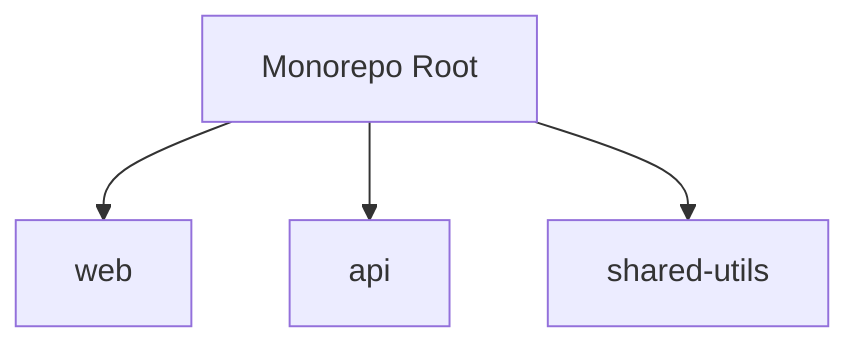

# Mega Project Setup Orchestrator

## Purpose

Guide users through comprehensive project initialization using the mega setup system. This prompt orchestrates the entire setup process from discovery to validation.

## When to Use

- Starting a new project from scratch
- Need automated project scaffolding
- Want comprehensive documentation generated automatically
- Prefer guided experience over manual configuration

## Command

```bash
pnpm setup:mega
```

## Process Overview

The mega setup system executes 7 phases automatically:

1. **Discovery** - Interactive questions about project requirements
2. **PRD Generation** - Creates Product Requirements Document
3. **Code Generation** - Generates apps and packages
4. **Documentation** - Updates all documentation files
5. **Rules Recommendation** - Suggests appropriate coding standards
6. **Validation** - Runs quality checks
7. **Summary** - Provides next steps

## Phase 1: Project Discovery

### Basic Information

**Questions:**
- Project Name: What should we call this project?
- Description: What does this project do? (1-2 sentences)
- Package Scope: Organization scope for packages (e.g., @mycompany)

### Project Type (Multi-select)

- [ ] Web Application (React)
- [ ] Mobile Application (React Native)
- [ ] Desktop Application (Electron)
- [ ] API/Backend (Express)

### Frontend Configuration (if applicable)

**UI Library:**
- Mantine - 100+ components, TypeScript first
- Tailwind CSS - Utility-first, highly customizable
- React Native Paper - Material Design for mobile
- None - Custom styling

**State Management:**
- Redux - Predictable state, large apps
- Zustand - Lightweight, simple API (recommended)
- Context API - Built-in React
- None - Component state only

**Routing:**
- Yes - Include routing
- No - Static pages

### Backend Configuration (if API selected)

**Framework:**
- Express - Minimal, flexible (recommended)
- Fastify - High performance

**Database:**
- PostgreSQL (Prisma) - Relational, type-safe
- MongoDB (Mongoose) - NoSQL, flexible
- None - Add later

**Authentication:**
- JWT - Token-based
- OAuth - Social login
- None - Add later

### Features (Multi-select)

- [ ] User authentication
- [ ] Database integration
- [ ] File uploads
- [ ] Real-time features (WebSocket)
- [ ] Email notifications
- [ ] Payment processing
- [ ] Admin dashboard
- [ ] API documentation (OpenAPI/Swagger)

### Deployment Target

- Vercel - Web apps, APIs
- AWS - Full control
- Heroku - Simple deployment
- Self-hosted - Own infrastructure
- Not sure yet - Decide later

## Phase 2: PRD Generation

### Template Population

The system reads `docs/maintenance/templates/prd-template.md` and populates:

**YAML Frontmatter:**
- title: [PROJECT_NAME]
- description: [DESCRIPTION]
- status: draft
- version: 1.0.0
- last_updated: [CURRENT_DATE]

**Goals & Objectives:**
Generated based on project type:
- Web: Build responsive web application
- Mobile: Create cross-platform mobile experience
- API: Develop scalable RESTful API
- Desktop: Build native desktop application

**Functional Requirements:**
Mapped from features:
- FR-001: User authentication (if selected)
- FR-002: Database integration (if selected)
- FR-003: File upload handling (if selected)
- etc.

**Tech Stack:**
Documents all technology choices made during discovery.

**Epic List:**
Creates epics for each feature with user stories and acceptance criteria.

## Phase 3: Code Generation

### Generator Selection

Based on project type, runs:

**Web App:**
```typescript
createReactWebApp({
  name: 'web',
  packageScope: config.packageScope,
  description: config.description,
  features: {
    routing: true,
    stateManagement: 'zustand',
    ui: 'mantine',
    tailwind: false
  }
})
```

**API:**
```typescript
createExpressApi({
  name: 'api',
  packageScope: config.packageScope,
  description: config.description,
  features: {
    database: true,
    authentication: true,
    validation: true,
    cors: true,
    logging: true
  }
})
```

**Mobile:**
```typescript
createReactNativeApp({
  name: 'mobile',
  packageScope: config.packageScope,
  description: config.description,
  features: {
    navigation: true,
    stateManagement: 'zustand',
    ui: 'react-native-paper'
  }
})
```

**Desktop:**
```typescript
createElectronApp({
  name: 'desktop',
  packageScope: config.packageScope,
  description: config.description,
  features: {}
})
```

**Shared Packages (always):**
```typescript
createPackage({
  name: 'shared-utils',
  packageScope: config.packageScope,
  description: 'Shared utility functions',
  type: 'library'
})
```

## Phase 4: Documentation Updates

### Files Updated

**README.md (root):**
- Replace project name in title
- Update description
- Update package list table
- Update getting started instructions

**CHANGELOG.md (root):**
```markdown
## [1.0.0] - 2025-10-23

### Added
- Web application with React and Mantine
- Express API with PostgreSQL
- Shared utility packages
```

**docs/architecture/system-overview.md:**
```markdown
# System Overview

## Architecture



## Applications
- **web** (`apps/web`) - React web application
- **api** (`apps/api`) - Express backend API

## Tech Stack
- Frontend: React 18, Vite, Mantine
- Backend: Express, Prisma, PostgreSQL
```

## Phase 5: Rules Recommendation

### Rule Matching Logic

**Frontend Projects:**
- `atomic-design-component-strategy.rules.mdc` - High priority, always
- `react-bulletproof-component-pattern.rules.mdc` - High priority, always
- `mobile-first-design.rules.mdc` - Medium priority, if web
- `react-native-component-standards.rules.mdc` - High priority, if mobile

**Backend Projects:**
- `monorepo-node-express-architecture.rules.mdc` - High priority, always
- `node.functional-isolated-concerns.rules.mdc` - High priority, always

**Testing (always):**
- `tests.tdd-workflow.rules.mdc` - High priority
- `tests.continuous-validation.rules.mdc` - High priority
- `tests.unified-testing.rules.mdc` - Medium priority

**Documentation (always):**
- `monorepo-documentation-strategy.rules.mdc` - Medium priority
- `monorepo-package-docs-versioning.rules.mdc` - Low priority

**Monorepo (always):**
- `monorepo-structure-and-configuration.rules.mdc` - High priority

## Phase 6: Validation

### Validation Steps

1. **Install Dependencies:**
```bash
pnpm install
```

2. **Run Validation:**
```bash
pnpm brain:validate
```

3. **Check Results:**
- Read `_errors/validation-summary.md`
- Identify errors by type (typecheck, lint, format, test)

4. **Auto-Fix Attempts:**
```bash
pnpm format --write  # Fix formatting
pnpm lint --fix      # Fix linting
```

5. **Re-validate:**
```bash
pnpm brain:validate
```

6. **Report:**
- Success: All checks passed
- Partial: Some auto-fixes applied
- Failed: Manual intervention needed

## Phase 7: Summary Generation

### Summary Format

```markdown
# 🎉 Project Setup Complete!

## Generated Structure

**Apps:**
- `apps/web` - React web application
- `apps/api` - Express backend API

**Packages:**
- `packages/shared-utils` - Shared utility functions

## Documentation Created

- ✅ PRD: `docs/architecture/prd.md`
- ✅ System Overview: `docs/architecture/system-overview.md`
- ✅ Root README: `README.md`
- ✅ CHANGELOG: `CHANGELOG.md`

## Rules Recommended

- ✅ atomic-design-component-strategy (high priority)
- ✅ react-bulletproof-component-pattern (high priority)
- ✅ monorepo-node-express-architecture (high priority)
- ✅ tests.tdd-workflow (high priority)

## Validation Status

✅ All validations passed

## Next Steps

1. Review the PRD: `docs/architecture/prd.md`
2. Start development: `pnpm dev`
3. Run tests: `pnpm test`
4. Check validation: `pnpm brain:validate`

## Common Commands

```bash
pnpm dev                # Start all apps
pnpm test              # Run all tests
pnpm build             # Build all apps
pnpm brain:validate    # Check for errors
```

## Need Help?

- Documentation: `docs/`
- Guides: `docs/guides/`
- Mega Setup Guide: `docs/guides/mega-setup-guide.md`
```

## Reference Documentation

- `.brain/prompts/plan-generation/create-project-overview.prompt.md`
- `.brain/prompts/plan-generation/create-initial-project-tech-stack.prompt.md`
- `docs/maintenance/templates/prd-template.md`

## Success Indicators

- [ ] All 7 phases complete without errors
- [ ] PRD generated with all sections populated
- [ ] All selected apps and packages created
- [ ] Documentation updated consistently
- [ ] Rules recommended appropriately
- [ ] Validation passes or provides clear guidance
- [ ] Summary displays next steps clearly

## Error Handling

**If discovery cancelled:**
- Exit gracefully
- No files modified

**If generation fails:**
- Report error with context
- Continue with other generators
- Mark failed items in summary

**If validation fails:**
- Attempt auto-fixes
- Report remaining issues
- Provide manual fix guidance
- Don't block completion

**If documentation update fails:**
- Log error
- Continue to next phase
- Note in summary

## Tips for Best Results

1. **Be specific** with project description
2. **Select only needed features** - add more later
3. **Choose familiar tech stack** - easier to customize
4. **Review generated code** before committing
5. **Run tests early** to catch issues
6. **Customize incrementally** - don't change everything at once

## Related Prompts

- `.brain/prompts/plan-generation/` - Project planning prompts
- `.brain/prompts/validation/` - Validation prompts
- `.brain/prompts/documentation/` - Documentation prompts
