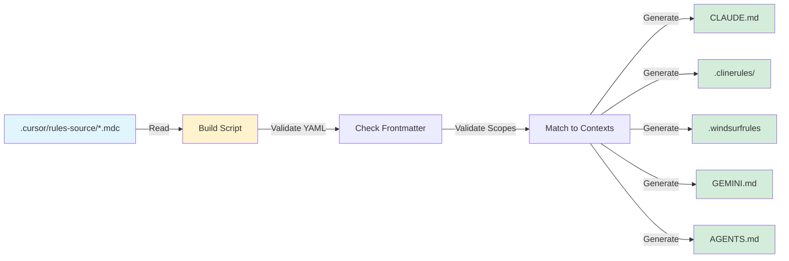

# Cursor Rules - Source of Truth

This directory contains the **19 original detailed rule files** that serve as the single source of truth for development standards in this monorepo.

> **Note:** `.cursor/rules` is a symlink to this directory (`.cursor/rules-source`). Cursor reads `.mdc` files directly from this source via the symlink. The symlink must exist locally for Cursor to load rules correctly.

## Overview

These rules were restored from the backup directory and normalized with proper YAML frontmatter to enable:
- **Scope-based distribution**: Rules apply based on context and file patterns
- **Intelligent activation**: Rules trigger when relevant to current work
- **Clear categorization**: Organized by architectural concerns
- **Automated distribution**: Build system generates CLI-specific formats

## Rule Categories

### 1. Foundation Rules
Core monorepo structure and configuration:
- `monorepo-structure-and-configuration.rules.mdc` - ESM-only, no-build libraries, shared config (**alwaysApply: true**)

### 2. React/Frontend Rules
Component patterns and UI development:
- `atomic-design-component-strategy.rules.mdc` - Wrap third-party UI components
- `storybook-first-composition.rules.mdc` - Build components in isolation first
- `mobile-first-design.rules.mdc` - Progressive enhancement from mobile
- `react-bulletproof-component-pattern.rules.mdc` - Comprehensive React standards
- `component-design-decision-tree.rules.mdc` - Choose the right component pattern
- `platform-pathways-pattern.rules.mdc` - Different mobile/desktop layouts

### 3. Backend Rules
Server architecture and Node.js patterns:
- `monorepo-node-express-architecture.rules.mdc` - Express.js with functional DI
- `node.functional-isolated-concerns.rules.mdc` - Functional patterns for scripts/CLIs
- `cm-proxy-rules.mdc` - Content Manager API proxy patterns
- `project-wide-proxy-rules.mdc` - General proxy and middleware patterns

### 4. Testing Rules
Validation and testing strategies:
- `tests.tdd-workflow.rules.mdc` - 5-step TDD process
- `tests.continuous-validation.rules.mdc` - Brain monitor integration
- `tests.unified-testing.rules.mdc` - Unit, integration, and E2E strategy
- `testid.rules.mdc` - TestID management conventions
- `brain-monitor-validation.rules.mdc` - Validation workflow and error management

### 5. Documentation Rules
Documentation and workflow standards:
- `monorepo-documentation-strategy.rules.mdc` - Documentation hierarchy
- `monorepo-package-docs-versioning.rules.mdc` - Package docs and versioning
- `pr-creation-guidelines.mdc` - Pull request workflow

## Frontmatter Structure

All rule files must have valid YAML frontmatter with these fields:

```yaml
---
description: Brief description of what this rule enforces
globs:
  - "pattern/to/match/**/*"    # File patterns this rule applies to
  - "another/pattern/**/*.tsx"  # Can have multiple patterns
scopes:
  - scope1    # Context keywords that trigger this rule
  - scope2    # e.g., react, backend, testing
alwaysApply: false  # true = applies to all files, false = selective
---
```

### Field Definitions

- **description** (required): One-line summary of the rule's purpose
- **globs** (required): Array of glob patterns for file matching (empty array if alwaysApply: true)
- **scopes** (required): Array of context keywords for intelligent activation
- **alwaysApply** (required): Boolean - if true, rule applies globally regardless of file patterns

### Valid Scope Values

Common scope values used across rules:

**Architecture & Structure:**
- `monorepo` - Monorepo-wide concerns
- `global` - Applies everywhere
- `architecture` - System design decisions

**Frontend:**
- `react` - React components and patterns
- `frontend` - Client-side code
- `ui` - User interface concerns
- `components` - Component development
- `storybook` - Storybook stories
- `vite` - Vite configuration
- `mantine` - Mantine UI library
- `responsive` - Responsive design

**Backend:**
- `backend` - Server-side code
- `node` - Node.js specific
- `express` - Express.js framework
- `api` - API development
- `mongodb` - Database concerns
- `proxy` - Proxy patterns
- `middleware` - Middleware configuration
- `tooling` - Build tools and scripts

**Testing & Quality:**
- `testing` - All testing concerns
- `tdd` - Test-driven development
- `validation` - Code validation
- `monitoring` - Error monitoring

**Workflow:**
- `git` - Version control
- `workflow` - Development workflow
- `documentation` - Docs and comments
- `versioning` - Package versioning
- `packages` - Package management

## Build System Integration

The build system (`.cursor/sync/build-consolidated-rules.ts`) transforms these source rules into multiple CLI-specific formats.

### Generated Outputs

When you run `pnpm rules:build`, the following files are generated:

| Output | CLI | Description |
|--------|-----|-------------|
| `CLAUDE.md` (hierarchical) | Cursor | Context-specific rules at root, apps/, packages/ |
| `.clinerules/` folder | Cline | Numbered rule files (00-meta + 01-XX) |
| `.windsurfrules` file | Windsurf | Single file with activation metadata |
| `GEMINI.md` (hierarchical) | Gemini | @import directives for hierarchical loading |
| `AGENTS.md` (hierarchical) | Brain Garden | Agent-specific format (core + contextual) |

### Build Commands

```bash
# Standard build (with warnings)
pnpm rules:build

# Strict mode (warnings = errors, fails build)
pnpm rules:build:strict

# Verify distribution correctness
pnpm rules:verify

# Build + verify in one step
pnpm rules:build:verify

# Watch mode (auto-rebuild on file changes)
pnpm rules:watch
```

### Build Process Flow



### Context-Based Distribution

Rules are distributed to contexts based on scope matching:

**Root context** (`/CLAUDE.md`):
- Scopes: `['*']` (special: includes ALL rules)
- Purpose: Complete reference for entire monorepo

**Frontend contexts** (`/apps/client/CLAUDE.md`, `/packages/shared-ui/CLAUDE.md`):
- Scopes: `['monorepo', 'global', 'react', 'frontend', 'ui', 'components']`
- Purpose: Rules relevant to React/UI development

**Backend contexts** (`/apps/server/CLAUDE.md`, `/services/*/CLAUDE.md`):
- Scopes: `['monorepo', 'global', 'express', 'backend', 'api', 'node']`
- Purpose: Rules relevant to server/API development

**Testing contexts** (`/tooling/testing/CLAUDE.md`):
- Scopes: `['monorepo', 'global', 'node', 'tooling', 'testing']`
- Purpose: Rules relevant to testing and validation

See `.cursor/sync/contexts.ts` for complete context definitions.

## Adding New Rules

To add a new rule:

1. **Create file** named `<rule-name>.rules.mdc` in this directory
2. **Add YAML frontmatter** (all fields required):
   ```yaml
   ---
   description: Brief description of what this rule enforces
   globs:
     - "path/to/files/**/*.ts"
   scopes:
     - scope1
     - scope2
   alwaysApply: false
   ---
   ```
3. **Write rule content** in Markdown below frontmatter
4. **Build and verify**:
   ```bash
   pnpm rules:build:verify
   ```
5. **Check distribution**:
   - Verify rule appears in expected `CLAUDE.md` files
   - Check `.clinerules/` has new numbered file
   - Confirm `.windsurfrules` includes rule

## Modifying Rules

To modify an existing rule:

1. **Edit rule file** in this directory (`.cursor/rules-source/`)
2. **Ensure frontmatter remains valid YAML**
3. **Update description** if rule's purpose changed
4. **Adjust scopes** if context applicability changed
5. **Rebuild**:
   ```bash
   pnpm rules:build:verify
   ```
6. **Verify changes** propagated to generated files

**Important:** NEVER edit generated files directly:
- `CLAUDE.md`, `AGENTS.md`, `GEMINI.md` (root or context-specific)
- `.clinerules/` folder contents
- `.windsurfrules` file

Always edit source files in `.cursor/rules-source/` and rebuild.

## Rule Priority

When multiple rules could apply:

1. **alwaysApply: true** rules have highest priority
2. Rules with more specific glob patterns override general ones
3. Rules with more scopes are considered more specific
4. Newer rules override older ones for the same scope

## Validation

The build system validates:

1. **YAML Syntax**: Frontmatter must be valid YAML
2. **Required Fields**: All fields must be present
3. **Scope Values**: Scopes checked against valid list (warnings for unknown)
4. **Character Limits**: Warns if rules exceed 12K characters
5. **Distribution**: Verification script audits scope-based filtering

### Validation Commands

```bash
# Validate and build
pnpm rules:build

# Strict validation (warnings = errors)
pnpm rules:build:strict

# Verify distribution correctness
pnpm rules:verify

# Build + verify in one step
pnpm rules:build:verify
```

### Common Validation Issues

**YAML Syntax Error:**
```
⚠️  rule-name.rules.mdc: Failed to parse frontmatter
```
→ Fix: Check YAML syntax (proper indentation, array format, no tabs)

**Unknown Scope Warning:**
```
⚠️  rule-name.rules.mdc uses unknown scope: custom-scope
```
→ Fix: Add scope to `VALID_SCOPES` in build script or use known scope

**Character Limit Warning:**
```
⚠️  rule-name.rules.mdc exceeds 12K chars (15000)
```
→ Fix: Consider splitting into focused sub-rules

**Under-Distribution:**
```
❌ Under-Distribution: packages/shared-ui
   Missing: rule-name
```
→ Fix: Add appropriate scope to rule frontmatter or adjust context scopes

See [RULES_TROUBLESHOOTING.md](/docs/maintenance/RULES_TROUBLESHOOTING.md) for detailed troubleshooting.

## Migration Notes

These 19 original rules were restored from `.cursor/_backup/` on 2025-10-22 as part of the Repository Documentation Cleanup Campaign. The previous consolidated rules (10 files) are preserved in `.cursor/rules-consolidated-backup/` for reference.

### Key Differences from Consolidated Rules:
- **More granular**: 19 files vs 10 consolidated
- **Better scoping**: Each rule has specific scope triggers
- **Clearer boundaries**: One concern per file
- **Easier maintenance**: Update individual rules without affecting others
- **Automated distribution**: Build system generates CLI-specific formats

### Migration Path

**Old workflow:**
```bash
# Edit consolidated rule directly
vim .cursor/rules/01-foundation.rules.mdc
# No build step needed
```

**New workflow:**
```bash
# Edit source rule
vim .cursor/rules-source/monorepo-structure-and-configuration.rules.mdc

# Build and verify
pnpm rules:build:verify
```

## Troubleshooting

### Rule Not Appearing in Expected Context

**Issue:** Rule doesn't show up in expected `CLAUDE.md` or `AGENTS.md` file.

**Check:**
1. Verify scopes match target context (see `.cursor/sync/contexts.ts`)
2. Ensure frontmatter YAML is valid
3. Run `pnpm rules:verify` to see distribution report

**Fix:**
- Add appropriate scope to rule frontmatter
- Or adjust context scopes in `contexts.ts`
- Rebuild with `pnpm rules:build:verify`

### Rule Appearing in Wrong Context

**Issue:** Rule shows up in unintended `CLAUDE.md` file.

**Check:**
1. Review scopes in rule frontmatter
2. Check if scope is overly broad (e.g., `global`)

**Fix:**
- Remove broad scopes or make more specific
- Use targeted scopes (e.g., `react` instead of `global`)
- Rebuild with `pnpm rules:build:verify`

### Build Warnings About Unknown Scopes

**Issue:** Build warns about unknown scope values.

**Expected for:**
- Specialized scopes (e.g., `proxy`, `middleware`)
- Experimental features
- Plugin-specific scopes

**Fix if unintended:**
- Use scope from valid list (see above)
- Or add scope to `VALID_SCOPES` in build script

### Verification Fails with Under-Distribution

**Issue:** `pnpm rules:verify` reports missing rules in context.

**Common cause:** Rule name mismatch (cosmetic issue).

**Check:**
- Manually inspect `AGENTS.md` file to confirm rule is present
- Verify rule content appears (even if name differs slightly)

**Fix if actually missing:**
- Add appropriate scope to rule frontmatter
- Rebuild with `pnpm rules:build`

See [RULES_TROUBLESHOOTING.md](/docs/maintenance/RULES_TROUBLESHOOTING.md) for comprehensive troubleshooting guide.

## Related Documentation

- [RULE_SYSTEM.md](/docs/maintenance/RULE_SYSTEM.md) - Comprehensive rule system architecture
- [RULES_MIGRATION_GUIDE.md](/docs/maintenance/RULES_MIGRATION_GUIDE.md) - Migration from consolidated rules
- [RULES_TROUBLESHOOTING.md](/docs/maintenance/RULES_TROUBLESHOOTING.md) - Troubleshooting reference
- [AGENT_INSTRUCTIONS.md](/docs/maintenance/AGENT_INSTRUCTIONS.md) - Comprehensive agent guide
- [DOCUMENTATION_STANDARDS.md](/docs/maintenance/DOCUMENTATION_STANDARDS.md) - Documentation conventions

## Build System Architecture

For detailed architecture documentation, see [RULE_SYSTEM.md - Architecture](/docs/maintenance/RULE_SYSTEM.md#architecture).

**Key components:**
- **Build script**: `.cursor/sync/build-consolidated-rules.ts`
- **Context definitions**: `.cursor/sync/contexts.ts`
- **Verification script**: `scripts/verify-rule-distribution.ts`
- **Source rules**: `.cursor/rules-source/*.mdc` (this directory)

**Build flow:**
```
Source rules → Validate → Distribute → Generate CLI formats → Verify
```

---

*Last Updated: 2025-10-22*
*Version: 1.0.0*
*See [RULE_SYSTEM.md](/docs/maintenance/RULE_SYSTEM.md) for comprehensive documentation*
