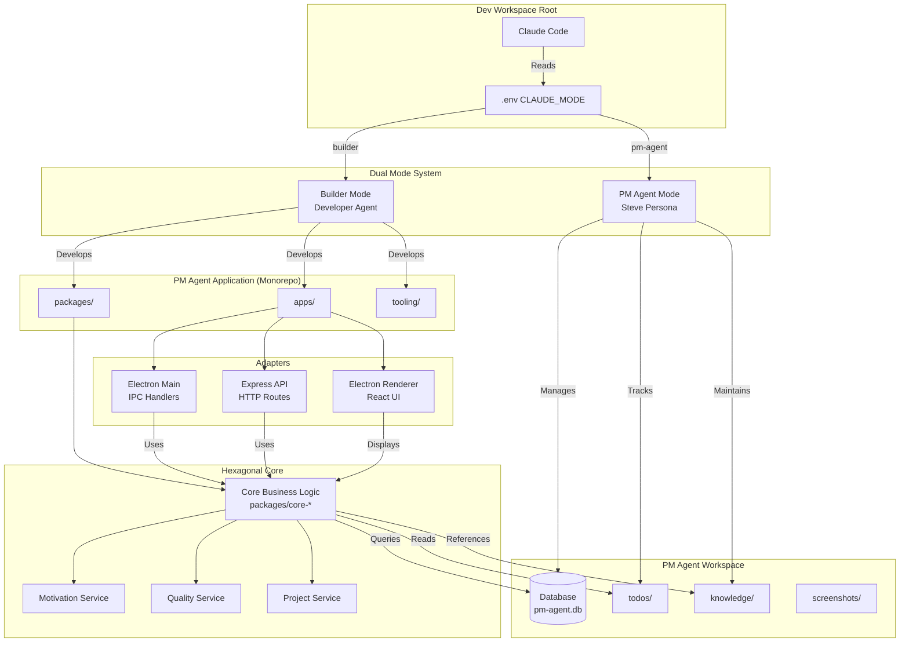

# PM Agent System Overview

## What is PM Agent?

**PM Agent** is a Motivation Engine that solves the AI development motivation crisis. It's both:
1. **An Electron Desktop Application** - For visual motivation dashboards
2. **An AI Agent (Steve)** - That manages your 190+ projects in the Dev workspace

## The Core Problem

AI-assisted development is 10x faster, but creates a unique motivation crisis:
- Developers build so fast they don't remember what they built
- Less hands-on time = Less domain recall
- Memory distortions cause valuable work to be abandoned
- Restart spiral instead of resuming nearly-finished projects

## The Solution

PM Agent tracks and displays **motivation metrics** that prove project value:
- 💪 **Effort Invested** (sessions, tokens, commits, hours)
- 🏗️ **Infrastructure Depth** (tests, coverage, CI/CD, zero errors)
- ✨ **Working Features** (mapped to user stories, proven by tests)
- 📚 **Documentation Quality** (README scores, changelog, docs/)
- 🎯 **Progress Tracking** (% complete, proximity to milestones)
- 🖼️ **Visual Memory** (screenshots to refresh recall)

---

## System Architecture



---

## Directory Structure

```
/Users/dmieloch/Dev/              # PM Agent's Domain
├── apps/                         # PM Agent Application
│   ├── viewer/                   # Electron desktop UI
│   ├── main/                     # Electron main process
│   └── api/                      # Express API server
│
├── packages/                     # Shared packages
│   ├── core-motivation/          # Motivation verdict logic
│   ├── core-quality/             # Quality score calculation
│   ├── core-projects/            # Project management
│   ├── pm-scripts/               # CLI tools (scan, health, quality)
│   └── shared-ui/                # Reusable React components
│
├── tooling/                      # Development tooling
│   ├── env-loader/               # Config management
│   └── brain-monitor/            # Validation & monitoring
│
├── .pm-agent/                    # PM AGENT WORKSPACE
│   ├── db/
│   │   └── pm-agent.db           # 177+ projects tracked
│   ├── todos/
│   │   ├── session-todos.json   # Current session work
│   │   ├── project-todos.json   # Per-project backlog
│   │   └── completed-todos.json # Accomplishment history
│   ├── knowledge/
│   │   ├── patterns/             # Recurring issues (3+ occurrences)
│   │   ├── insights/             # Developer preferences
│   │   └── decisions/            # Architecture decisions
│   ├── screenshots/              # Visual memory aids
│   └── docs/                     # PM Agent procedures
│
├── .cursor/                      # DUAL-MODE RULES
│   ├── rules-source-builder/     # Developer rules (13 files)
│   ├── rules-source-pm-agent/    # PM behavior rules (6 files)
│   ├── sync/                     # Build system
│   └── DUAL_MODE_GUIDE.md
│
├── .env                          # CLAUDE_MODE=builder|pm-agent
├── package.json
├── pnpm-workspace.yaml
│
└── [190+ projects...]            # All projects PM manages
    ├── cannabis-codex/
    ├── brain-garden-os/
    ├── scheduling-station/
    └── ...
```

---

## Dual-Mode Claude Code System

PM Agent uses a unique **dual-mode** approach where Claude Code can be:

### 🔧 Builder Mode (`CLAUDE_MODE=builder`)

**Purpose:** Build the PM Agent application itself

**Rules:** `.cursor/rules-source-builder/` (13 rules)
- Hexagonal architecture (Electron + Express adapters)
- TDD workflow (E2E > Integration > Unit)
- SQLite repository patterns
- React bulletproof patterns (desktop-only)
- PM Agent domain logic

**What Claude Does:**
- Develops apps in `apps/`
- Builds packages in `packages/`
- Writes tests first (TDD)
- Follows hexagonal architecture
- Implements features

### 🧠 PM Agent Mode (`CLAUDE_MODE=pm-agent`)

**Purpose:** BE the PM Agent (Steve) managing projects

**Rules:** `.cursor/rules-source-pm-agent/` (6 rules)
- Session protocol (load context, greet)
- Project analysis (quality scores, verdicts)
- Conversation style (Steve persona, ADHD-friendly)
- Knowledge management (patterns, insights)
- Todo discipline (track ALL work)
- Decision framework (resume/pause/archive)

**What Claude Does:**
- Acts as Steve (late 50s South Philly Italian PM)
- Loads session context from `.pm-agent/todos/`
- Queries project database
- Generates motivation verdicts
- Tracks accomplishments
- Maintains knowledge base
- Helps with context switching

**Switching Modes:**
```bash
# Build the app
echo "CLAUDE_MODE=builder" > .env && npm run rules:build

# Be the PM
echo "CLAUDE_MODE=pm-agent" > .env && npm run rules:build
```

---

## Hexagonal Architecture (Ports & Adapters)

### Core Business Logic (Platform-Agnostic)

**Location:** `packages/core-*/`

**No dependencies on:**
- ❌ Electron
- ❌ Express
- ❌ React
- ❌ Any platform-specific library

**Pure functions that:**
- Calculate quality scores
- Generate motivation verdicts
- Track progress
- Manage projects

### Adapters (Platform-Specific)

**Electron Main Process** (`apps/main/`)
- IPC handlers
- Translate IPC calls → Core service calls
- Window management
- System integration

**Express API Server** (`apps/api/`)
- HTTP routes
- Translate HTTP requests → Core service calls
- RESTful API
- CLI tool backend

**Electron Renderer** (`apps/viewer/`)
- React components
- Displays data from Core
- Desktop UI (no mobile/responsive)
- Motivation dashboard

**Same Core, Multiple Delivery Mechanisms:**
```typescript
// Core service (platform-agnostic)
export const makeMotivationService = (deps) => ({
  getVerdict: async (projectId) => {
    // Pure business logic
  }
});

// Electron adapter
export const makeGetVerdictIpc = (service) =>
  async (_event, projectId) => service.getVerdict(projectId);

// Express adapter
export const makeGetVerdictHttp = (service) =>
  async (req, res) => res.json(await service.getVerdict(req.params.id));
```

---

## Tech Stack

### Frontend (Desktop Only)
- **Framework:** React 18+
- **UI Library:** Mantine
- **Desktop:** Electron
- **Styling:** @emotion/styled
- **State:** React Query
- **Patterns:** Bulletproof React (desktop-focused)

### Backend
- **Electron Main:** Node.js + TypeScript
- **API Server:** Express.js
- **Database:** SQLite (better-sqlite3)
- **Pattern:** Hexagonal Architecture with Functional DI
- **Validation:** Zod

### Development
- **Monorepo:** pnpm workspaces + Turborepo
- **Testing:** E2E > Integration > Unit (Brain Garden)
- **Validation:** Brain Monitor
- **Language:** TypeScript (ESM-only)

---

## Data Flow

### Motivation Verdict Generation

```
1. User (PM Agent Mode): "Should I resume cannabis-codex?"
   ↓
2. PM Agent queries database:
   - Quality score (94/100)
   - Session count (47)
   - Progress (87%)
   - Features completed (12/15)
   ↓
3. Core Motivation Service calculates verdict:
   - Score: 94 (quality) + 87 (progress) + ...
   - Decision: "ABSOLUTELY WORTH RESUMING"
   ↓
4. PM Agent (Steve) responds:
   "You're 87% done with cannabis-codex! Quality is 94/100.
    Just 3 features left. Want to finish this?"
```

### Project Scanning

```
1. PM Agent Mode: "Scan all projects"
   ↓
2. pm-scripts/scan-projects.js:
   - Walks Dev/ directory
   - Detects git repos
   - Checks tech stack
   - Updates database
   ↓
3. Database updated with 177+ projects
   ↓
4. PM Agent: "Found 3 new projects. Updated all status."
```

---

## Key Features

### For Developer
1. **Motivation Dashboard** - See quality scores, progress, effort
2. **Session Tracking** - All work tracked in `.pm-agent/todos/`
3. **Knowledge Base** - Patterns detected automatically
4. **Visual Memory** - Screenshots refresh recall
5. **Context Switching** - Easy resume after months away

### For PM Agent (Steve)
1. **Session Protocol** - Load context automatically
2. **Project Analysis** - Calculate quality & motivation
3. **Recommendations** - Resume/pause/archive suggestions
4. **Pattern Detection** - Find recurring issues
5. **ADHD-Friendly** - Visual, organized, non-judgmental

---

## Database Schema

**Location:** `.pm-agent/db/pm-agent.db`

**Key Tables (20+ total):**
- `projects` - All 177+ tracked projects
- `quality_scores` - Calculated quality metrics
- `claude_sessions` - Session tracking
- `features` - Feature completion tracking
- `testing_config` - Test infrastructure
- `project_health` - Real-time health checks

**Key Views:**
- `project_quality_dashboard` - CI/CD-like health view
- `my_projects` - User's original work only
- `projects_by_value` - Sorted by calculated value

---

## Deployment

**Target:** Local Development Machine

- Electron app runs locally
- Express API runs locally (optional)
- SQLite database in `.pm-agent/db/`
- All data stays on developer's machine

---

## Related Documentation

- [Backend Architecture](./backend.md) - Hexagonal architecture details
- [Frontend Architecture](./frontend.md) - React/Electron patterns
- [Database Architecture](./database.md) - SQLite schema
- [Dual Mode Guide](../../.cursor/DUAL_MODE_GUIDE.md) - Mode switching
- [PM Agent BMAD](../../.pm-agent/docs/PM_AGENT_BMAD.md) - Complete operating manual

---

**Last Updated:** 2025-11-08
**Status:** Active Documentation
**Architecture Type:** Hexagonal (Ports & Adapters)
**Deployment:** Local Development Environment
