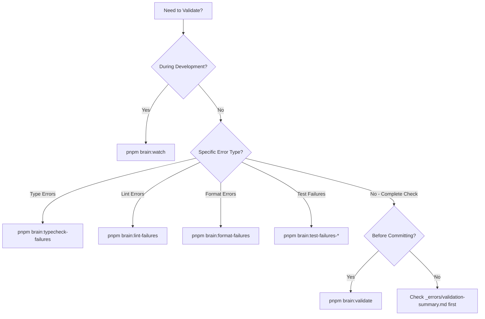
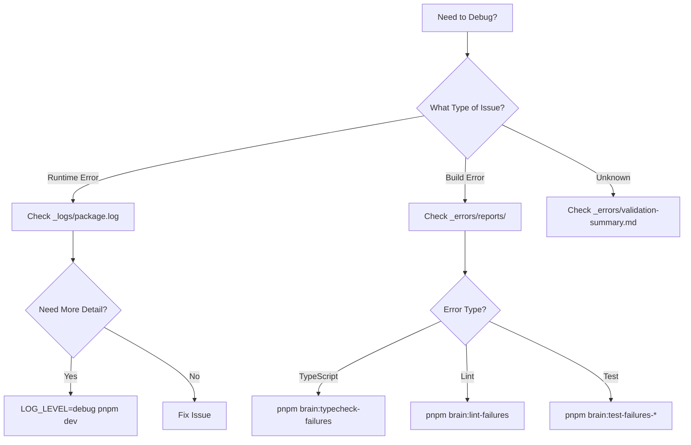
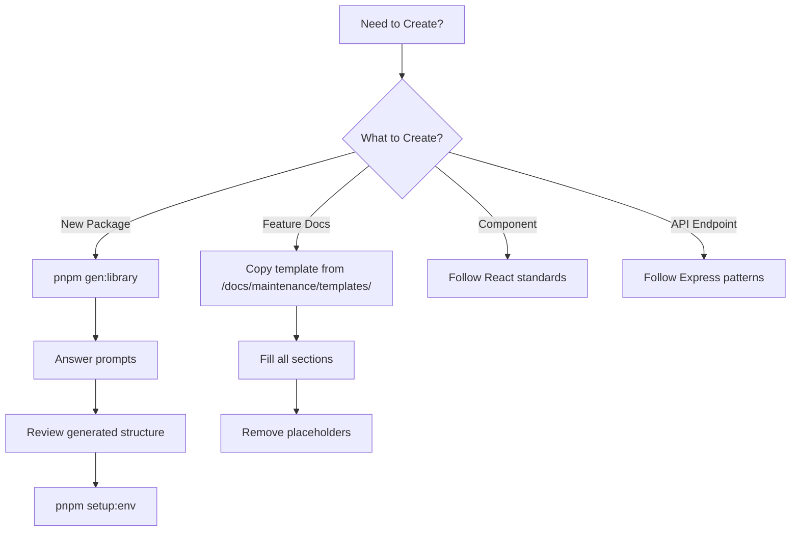
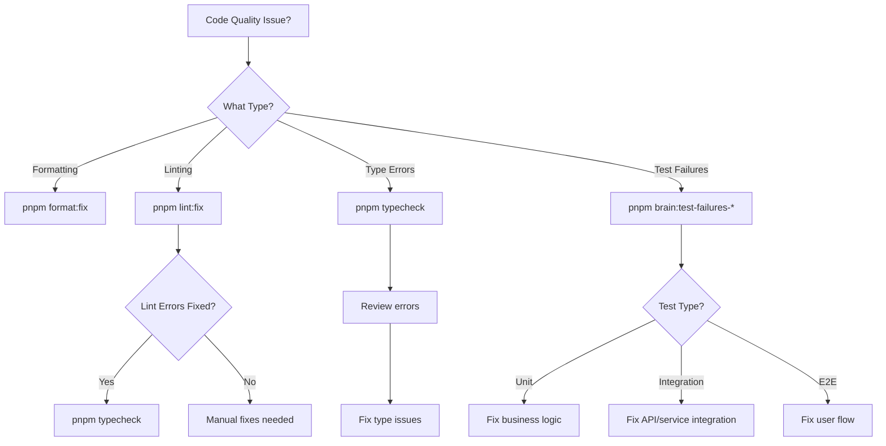
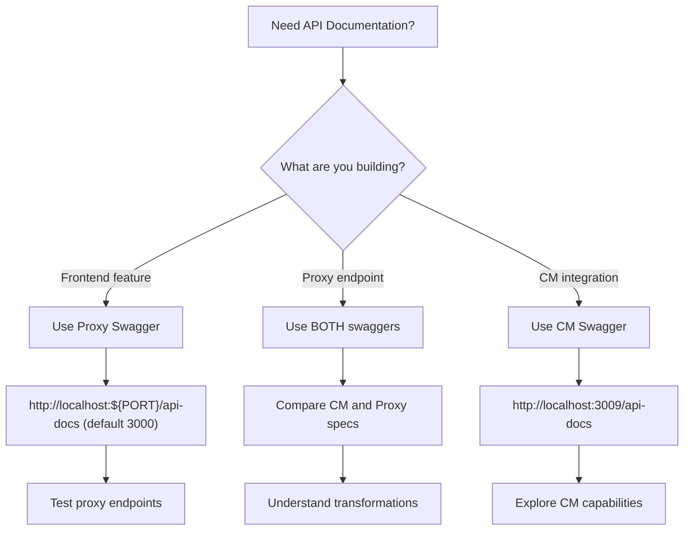

# Developer Tools - Quick Reference

Fast command lookup and decision trees for common development tasks.

## Validation Commands

| Command | Speed | Coverage | When to Use |
|---------|-------|----------|-------------|
| `pnpm brain:validate` | Slow | Complete | Before committing, comprehensive check |
| `pnpm brain:watch` | Fast | Incremental | During development, continuous feedback |
| `pnpm brain:typecheck-failures` | Fast | TypeScript only | Fixing type errors specifically |
| `pnpm brain:lint-failures` | Fast | ESLint only | Fixing lint errors specifically |
| `pnpm brain:format-failures` | Fast | Prettier only | Fixing format errors specifically |
| `pnpm brain:test-failures-unit` | Medium | Unit tests only | Fixing unit test failures |
| `pnpm brain:test-failures-integration` | Medium | Integration tests only | Fixing integration test failures |
| `pnpm brain:test-failures-e2e` | Slow | E2E tests only | Fixing E2E test failures |

**⚠️ Important:** Always check `_errors/validation-summary.md` first to avoid redundant work.

### Validation Decision Tree

```
Need to validate?
├─ During development?
│  └─ Use: pnpm brain:watch (continuous feedback)
├─ Specific error type?
│  ├─ Type errors → pnpm brain:typecheck-failures
│  ├─ Lint errors → pnpm brain:lint-failures
│  ├─ Format errors → pnpm brain:format-failures
│  └─ Test failures → pnpm brain:test-failures-[type]
└─ Before committing?
   └─ Use: pnpm brain:validate (comprehensive)
```

## Development Commands

| Command | Purpose | When to Use |
|---------|---------|-------------|
| `pnpm dev` | Start all apps (no logging) | Normal development |
| `pnpm brain:dev` | Start all apps with logging | Debugging runtime issues |
| `pnpm setup:env` | Auto-configure ports and .env | After clone, branch switch, or worktree creation |
| `pnpm gen:library` | Create new package | Adding a new package to monorepo |
| `pnpm build` | Build all packages | Before deployment or testing builds |
| `pnpm clean:workspaces` | Clean all node_modules | Dependency issues or fresh install |

## API Documentation Commands

Interactive API exploration and testing.

### Proxy Swagger (Proxy Server API)

| Command | Purpose | When to Use |
|---------|---------|-------------|
| `echo "ENABLE_SWAGGER=true" >> .env` | Enable Proxy Swagger | First-time setup |
| `pnpm dev` | Start server with Swagger | After enabling swagger |
| `open http://localhost:${PORT}/api-docs` | Open Proxy Swagger UI (default 3000) | Explore proxy endpoints |

### CM Swagger (Content Manager API)

| Command | Purpose | When to Use |
|---------|---------|-------------|
| `pnpm start:cm-swagger` | Start CM Swagger service | Explore CM API |
| `open http://localhost:3009/api-docs` | Open CM Swagger UI | View CM endpoints |

### Both Swagger Systems

```bash
# Terminal 1: Start main server with Proxy Swagger
ENABLE_SWAGGER=true pnpm dev

# Terminal 2: Start CM Swagger service
pnpm start:cm-swagger
```

**Quick Decision:**
- Frontend development? → Use **Proxy Swagger**
- Proxy development? → Use **both** (CM for source, Proxy for target)
- Integration work? → Use **CM Swagger**

## Testing Commands

| Command | Coverage | Speed | When to Use |
|---------|----------|-------|-------------|
| `pnpm test` | All tests | Slowest | Pre-commit comprehensive validation |
| `pnpm test:unit` | Unit tests only | Fast | Testing business logic changes |
| `pnpm test:integration` | Integration tests only | Medium | Testing API and service integration |
| `pnpm test:e2e` | E2E tests only | Slowest | Testing complete user flows |
| `pnpm brain:test-failures-unit` | Unit test failures only | Fast | Fixing specific unit test failures |
| `pnpm brain:test-failures-integration` | Integration test failures only | Medium | Fixing specific integration test failures |
| `pnpm brain:test-failures-e2e` | E2E test failures only | Slow | Fixing specific E2E test failures |

**Note:** If `test:*` scripts aren't available at root level, use Turbo with filters or package-level scripts:

```bash
# Using Turbo with filter
turbo run test:unit --filter=@scala-cme/client

# Using pnpm filter
pnpm --filter @scala-cme/client run test:unit

# Or navigate to package
cd apps/client && pnpm test:unit
```

### Testing Decision Tree

```
Need to test?
├─ Changed business logic?
│  └─ Run: pnpm test:unit
├─ Changed API or services?
│  └─ Run: pnpm test:integration
├─ Changed user flows?
│  └─ Run: pnpm test:e2e
├─ Test failures reported?
│  └─ Run: pnpm brain:test-failures-[type]
└─ Before committing?
   └─ Run: pnpm test (all tests)
```

## Logging & Debugging Commands

| Command | Purpose | When to Use |
|---------|---------|-------------|
| `tail -f _logs/[package-name].log` | Real-time log streaming | Monitoring specific package runtime |
| `cat _errors/validation-summary.md` | View validation summary | Before running validations |
| `cat _errors/reports/errors.[type].md` | View specific error report | Debugging specific error type |
| `pnpm brain:logs` | View all logs | Monitoring all packages |
| `LOG_LEVEL=debug pnpm dev` | Enable debug logging | Deep debugging with verbose output |
| `LOG_LEVEL=trace pnpm dev` | Enable trace logging | Maximum verbosity for troubleshooting |

### Log Level Reference

| Level | Verbosity | Use Case |
|-------|-----------|----------|
| `fatal` | Minimal | Production errors only |
| `error` | Low | Application errors |
| `warn` | Low-Medium | Warnings and potential issues |
| `info` | Medium | General information (default) |
| `debug` | High | Development debugging |
| `trace` | Maximum | Deep troubleshooting |

## Code Quality Commands

| Command | Purpose | Auto-Fix | When to Use |
|---------|---------|----------|-------------|
| `pnpm lint` | Check linting | No | Checking for lint errors |
| `pnpm lint:fix` | Fix linting | Yes | Fixing lint errors automatically |
| `pnpm format` | Check formatting | No | Checking for format errors |
| `pnpm format:fix` | Fix formatting | Yes | Fixing format errors automatically |
| `pnpm typecheck` | Check types | No | Checking for type errors |

**💡 Tip:** Run in order for best results: `format:fix` → `lint:fix` → `typecheck` → `test`

## Tool Selection Matrix

| Scenario | Tool | Command | Rationale |
|----------|------|---------|-----------|
| Before running validations | Check reports | `cat _errors/validation-summary.md` | Avoid redundant work, see existing errors |
| Continuous validation | brain-monitor watch | `pnpm brain:watch` | Fast feedback loop during development |
| Pre-commit validation | brain-monitor validate | `pnpm brain:validate` | Comprehensive check before commit |
| Debugging runtime | Tail logs | `tail -f _logs/[package].log` | Real-time streaming for specific package |
| Debugging all packages | brain-monitor logs | `pnpm brain:logs` | Centralized log viewing |
| Creating package | Package generator | `pnpm gen:library` | Consistent structure and configuration |
| Environment setup | setup-env script | `pnpm setup:env` | Auto-configure ports per worktree |
| Format issues | Prettier | `pnpm format:fix` | Automatic code formatting |
| Lint issues | ESLint | `pnpm lint:fix` | Automatic lint fixes |
| Type issues | TypeScript | `pnpm typecheck` | Static type validation |

## Decision Trees

### Need to Validate Code?



### Need to Debug?



### Need to Create Something?



### Code Quality Issue?



### Which Swagger Should I Use?



## File Locations Reference

Quick lookup for important file locations:

| Category | Location | Purpose |
|----------|----------|---------|
| **Validation Reports** | `_errors/validation-summary.md` | Overall validation status |
| | `_errors/reports/errors.typecheck-failures.md` | TypeScript errors |
| | `_errors/reports/errors.lint-failures.md` | ESLint errors |
| | `_errors/reports/errors.format-failures.md` | Prettier errors |
| | `_errors/reports/errors.test-failures-unit.md` | Unit test failures |
| | `_errors/reports/errors.test-failures-integration.md` | Integration test failures |
| | `_errors/reports/errors.test-failures-e2e.md` | E2E test failures |
| **Log Files** | `_logs/[package-name].log` | Package-specific runtime logs |
| | `_logs/index.md` | Log index with package status |
| | `_logs/browser-console.log` | Browser console capture |
| **Configuration** | `.env.example` | Environment variable template |
| | `.env` | Local environment configuration |
| | `turbo.json` | Turbo pipeline configuration |
| | `pnpm-workspace.yaml` | Workspace package definitions |
| **Tool Configs** | `/tooling/brain-monitor/` | brain-monitor configuration |
| | `/tooling/logger/` | @kit/logger configuration |
| | `/tooling/testing/` | @kit/testing configuration |
| | `/tooling/env-loader/` | @kit/env-loader configuration |
| | `/tooling/eslint/` | ESLint presets |
| | `/tooling/prettier/` | Prettier configuration |
| | `/tooling/tsconfig/` | TypeScript presets |

## Common Patterns

### Starting Development Session

```bash
# Step 1: Check for existing errors
cat _errors/validation-summary.md

# Step 2: Setup environment (if needed)
pnpm setup:env

# Step 3: Start dev servers with logging
pnpm brain:dev

# Step 4: In separate terminal - start watch mode
pnpm brain:watch

# Step 5: In separate terminal - monitor specific package
tail -f _logs/server.log
```

### Before Committing Workflow

```bash
# Step 1: Run all validations
pnpm brain:validate

# Step 2: Review validation summary
cat _errors/validation-summary.md

# Step 3: Fix any issues (if errors found)
pnpm lint:fix && pnpm format:fix

# Step 4: Re-run validations if fixes were made
pnpm brain:validate

# Step 5: Verify clean validation
cat _errors/validation-summary.md

# Step 6: Commit changes
git add .
git commit -m "feat: your changes"
```

### Debugging Failing Tests

```bash
# Step 1: Identify test type from validation summary
cat _errors/validation-summary.md

# Step 2: Run specific test validation
pnpm brain:test-failures-unit  # or integration/e2e

# Step 3: Review detailed test report
cat _errors/reports/errors.test-failures-unit.md

# Step 4: Run tests with debug logging
LOG_LEVEL=debug pnpm test:unit

# Step 5: Fix issues and re-run
pnpm brain:test-failures-unit

# Step 6: Verify all tests pass
pnpm test
```

### Creating New Package

```bash
# Step 1: Run generator
pnpm gen:library

# Step 2: Answer prompts
# - Package name: @scala-cme/new-package
# - Description: Brief description
# - Type: library/ui/utility

# Step 3: Review generated structure
ls packages/new-package/

# Step 4: Setup environment
pnpm setup:env

# Step 5: Validate setup
pnpm brain:typecheck-failures

# Step 6: Install dependencies (if needed)
cd packages/new-package
pnpm add [dependencies]

# Step 7: Implement functionality
# ... write code ...

# Step 8: Create README and CHANGELOG
# Follow templates in /docs/maintenance/templates/
```

### Fixing Validation Errors

```bash
# Step 1: Check validation summary
cat _errors/validation-summary.md

# Step 2: Read detailed error report
cat _errors/reports/errors.[type].md

# Step 3: Run specific validation for faster feedback
pnpm brain:[type]-failures

# Step 4: Fix errors in recommended order
# Format → Lint → Typecheck → Test

# Step 5: Auto-fix what's possible
pnpm format:fix
pnpm lint:fix

# Step 6: Re-run specific validation
pnpm brain:[type]-failures

# Step 7: Repeat until clean
# ... iterate ...

# Step 8: Run full validation
pnpm brain:validate
```

## Environment Variables Quick Reference

Common environment variables used across tools:

| Variable | Values | Purpose | Context |
|----------|--------|---------|---------|
| `NODE_ENV` | development, test, production | Environment mode | Node.js |
| `LOG_LEVEL` | trace, debug, info, warn, error, fatal | Logging verbosity | Node.js (@kit/logger) |
| `LOG_THEME` | Dracula, Nord, Solarized, Gruvbox, etc. | Terminal color theme | Node.js (@kit/logger) |
| `VITE_LOG_LEVEL` | trace, debug, info, warn, error, fatal | Browser logging verbosity | Browser (@kit/logger) |
| `VITE_LOG_THEME` | Dracula, Nord, Solarized, Gruvbox, etc. | Browser color theme | Browser (@kit/logger) |
| `FORCE_COLOR` | 0, 1, 2, 3 | Force color output level | CLI tools |

**💡 Tip:** Browser environment variables must be prefixed with `VITE_` to be accessible in the browser.

## Keyboard Shortcuts & Tips

### Terminal Tips

```bash
# Watch logs with color support
tail -f _logs/server.log | less -R

# Search logs for errors
grep -i error _logs/server.log

# Find specific log pattern
grep "scope: UserAuth" _logs/server.log

# Count occurrences
grep -c "error" _logs/server.log

# Follow logs from multiple packages
tail -f _logs/server.log _logs/client.log

# Clear log files (if needed)
rm _logs/*.log
```

### Common Command Aliases

Add to your shell profile for faster access:

```bash
# Validation shortcuts
alias brain-validate="pnpm brain:validate"
alias brain-watch="pnpm brain:watch"
alias brain-tc="pnpm brain:typecheck-failures"
alias brain-lint="pnpm brain:lint-failures"

# Log shortcuts
alias logs-server="tail -f _logs/server.log"
alias logs-client="tail -f _logs/client.log"
alias logs-all="tail -f _logs/*.log"

# Validation summary
alias check-errors="cat _errors/validation-summary.md"
```

## Related Documentation

- [Validation Tools Guide](/docs/guides/developer-tools/validation-tools.md) - Detailed validation tool documentation
- [Development Workflows](/docs/guides/developer-tools/development-workflow.md) - Step-by-step workflow guides
- [Logging & Debugging](/docs/guides/developer-tools/logging-debugging.md) - Comprehensive debugging guide
- [Troubleshooting](/docs/guides/developer-tools/troubleshooting.md) - Common issues and solutions
- [Developer Tools Overview](/docs/guides/developer-tools/README.md) - Complete documentation index
