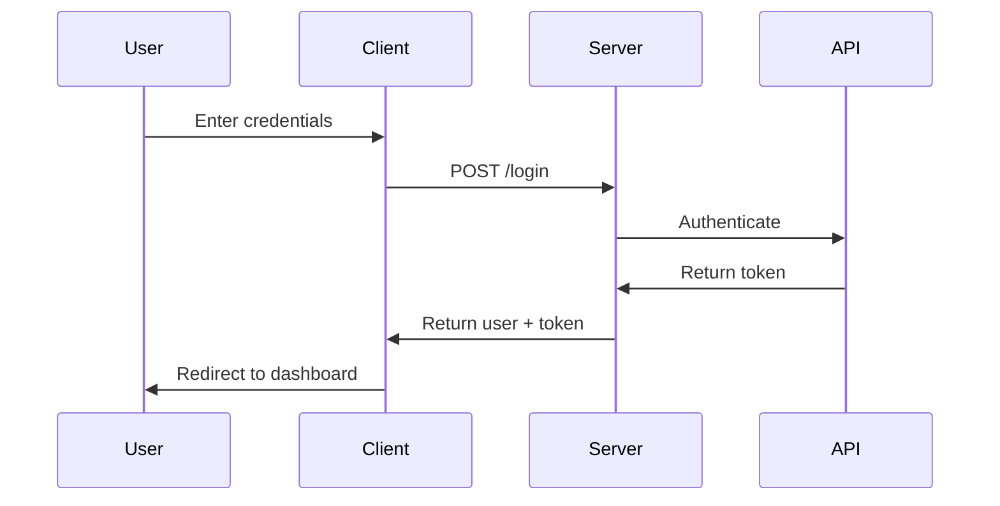
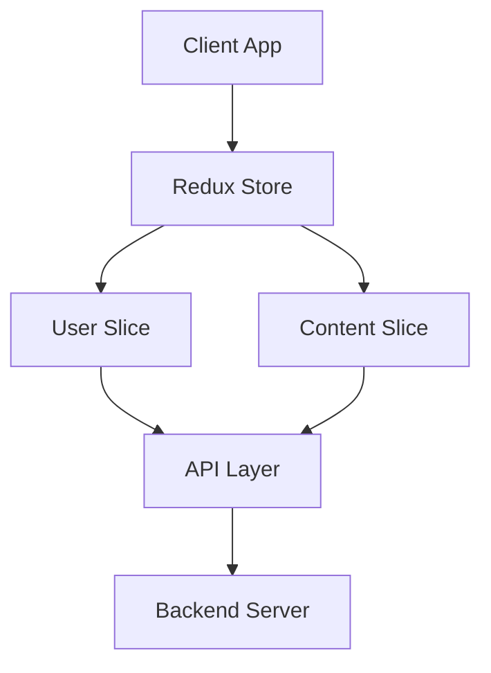
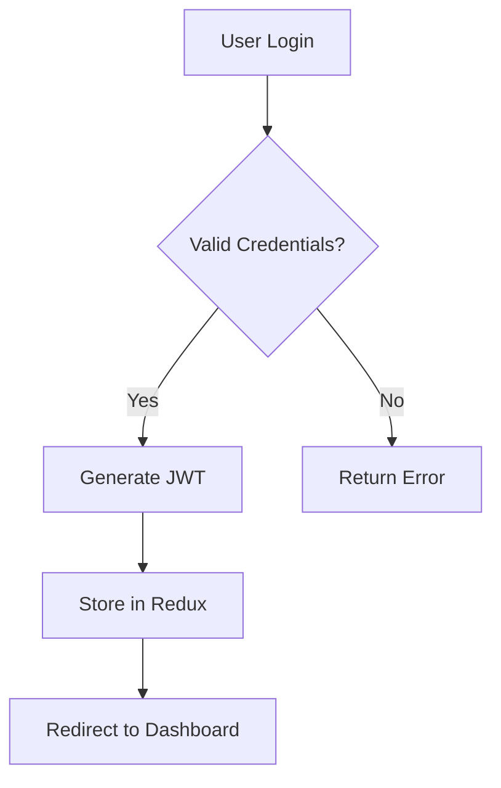
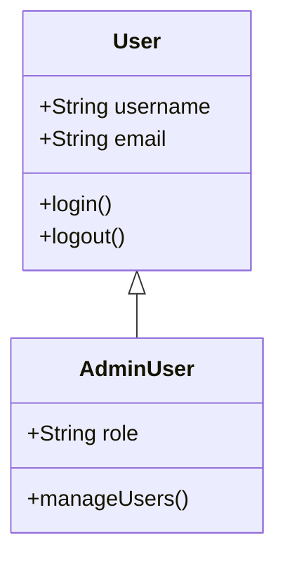
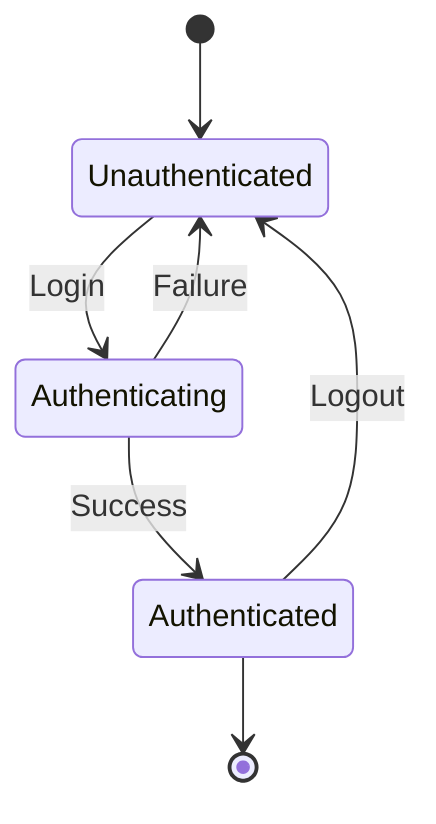
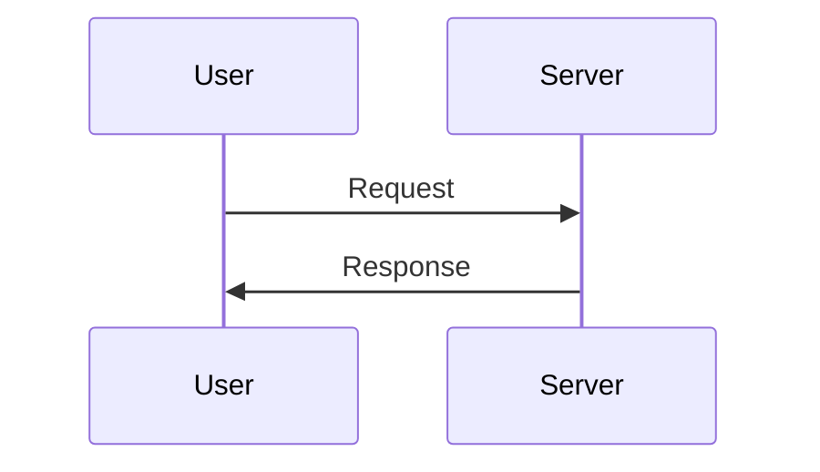
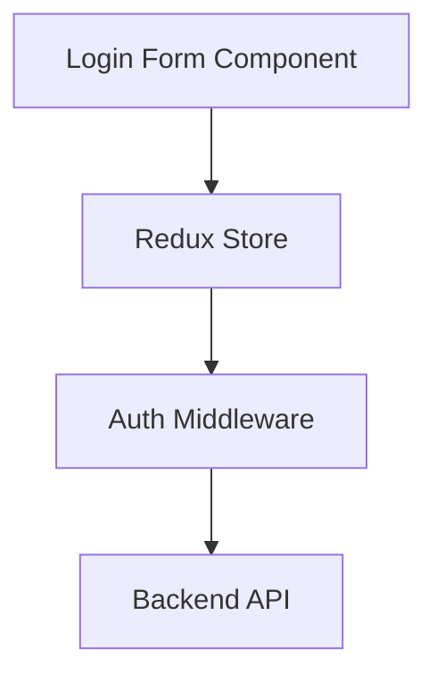
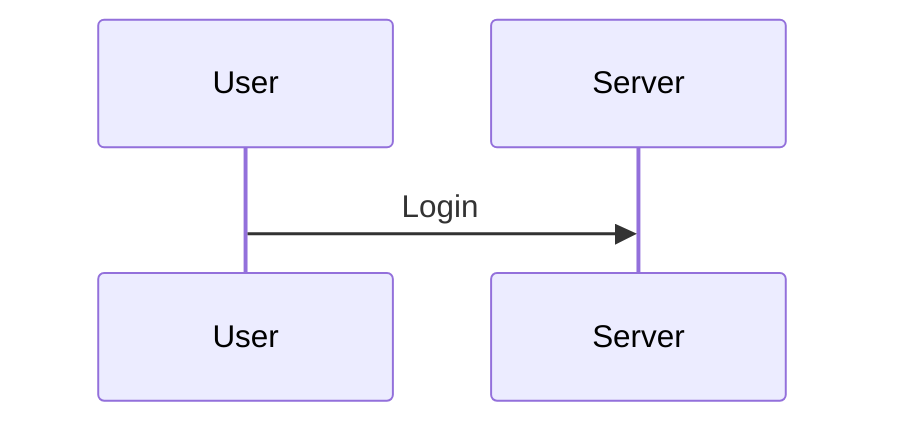
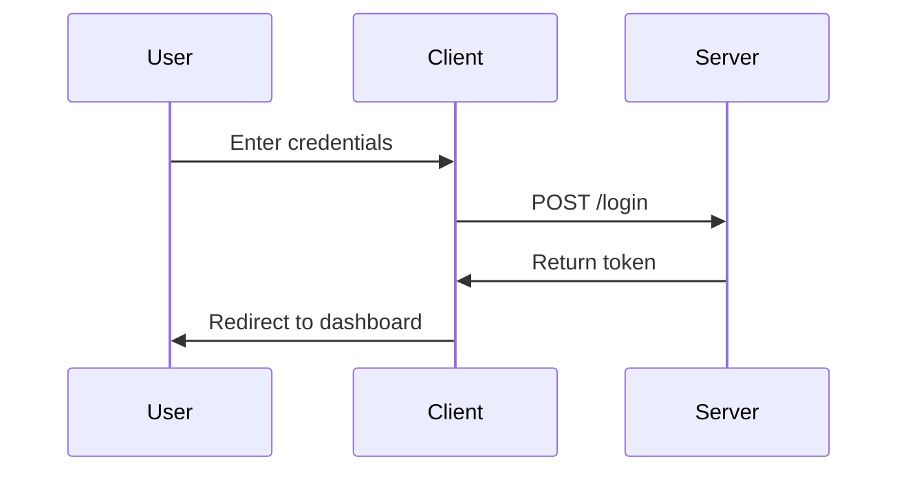

# Documentation Standards and Style Guide

## Introduction

This document defines the standards, style guidelines, and formatting conventions for all documentation in the Content Manager Express (CME) monorepo. Following these standards ensures consistency, quality, and maintainability across the entire documentation set.

**Purpose:** Ensure consistency and quality across all CME documentation.

**Scope:** All markdown files in `/docs`, package READMEs, and CHANGELOG files.

**Audience:** AI agents and human contributors maintaining CME documentation.

**Compliance:** All documentation must follow these standards.

## YAML Frontmatter Requirements

### Required for All Markdown Files

Every `.md` file in `/docs` must include YAML frontmatter at the beginning of the file.

### Standard Format

```yaml
---
title: "Document Title"
description: "Brief description of the document content"
keywords: [keyword1, keyword2, keyword3]
last_updated: "YYYY-MM-DD"
---
```

### Field Specifications

#### `title` (required, string)

- **Purpose:** Human-readable title of the document
- **Format:** Use title case (capitalize major words)
- **Length:** Keep concise (under 60 characters)
- **Examples:**
  - `"Authentication Feature"`
  - `"Frontend Architecture"`
  - `"User Management API"`
  - `"Deployment Guide"`

#### `description` (required, string)

- **Purpose:** One or two sentence description of document content
- **Format:** Complete sentence(s) ending with period
- **Length:** Keep under 160 characters
- **Guidelines:** Explain what the document covers
- **Examples:**
  - `"User authentication, login flows, and session management for CME"`
  - `"React component architecture, state management, and UI patterns"`
  - `"Backend API design, Express middleware, and service layer architecture"`

#### `keywords` (required, array of strings)

- **Purpose:** Relevant keywords for searching and categorization
- **Format:** Array of lowercase strings
- **Count:** 3-7 relevant keywords
- **Guidelines:** Include domain terms, technologies, and concepts
- **Examples:**
  - `[authentication, login, session, security, tokens]`
  - `[react, redux, components, state-management, ui]`
  - `[express, api, middleware, backend, nodejs]`

#### `last_updated` (required, string)

- **Purpose:** Track when document was last modified
- **Format:** ISO 8601 date format: `YYYY-MM-DD`
- **Guidelines:** Update whenever document content changes
- **Examples:**
  - `"2025-10-21"`
  - `"2025-09-15"`
  - `"2025-12-01"`

### Validation

- Frontmatter must be valid YAML and parseable
- All four required fields must be present
- Date must be in YYYY-MM-DD format
- Keywords must be an array (use brackets)

### Exceptions

- Root `README.md` may omit frontmatter
- `CHANGELOG.md` files may omit frontmatter
- All other markdown files require frontmatter

## Markdown Formatting Standards

### Headings

**Use ATX-style headings** (`#`, `##`, `###`):

```markdown
# Main Title

## Section Heading

### Subsection Heading

#### Fourth Level Heading
```

**Guidelines:**
- One H1 (`#`) per document (should match title in frontmatter)
- Maintain heading hierarchy (don't skip levels: H1 → H2 → H3)
- Add blank line before and after headings
- Use sentence case for headings (capitalize first word and proper nouns)

**Example:**
```markdown
# Authentication Feature

## Overview

This section provides an overview of the authentication system.

### Login Flow

The login flow consists of three steps.
```

### Paragraphs

**Formatting:**
- Separate paragraphs with blank line
- Keep paragraphs focused (3-5 sentences)
- Use line breaks for readability (wrap at 120 characters recommended but not required)

**Example:**
```markdown
The Content Manager Express uses token-based authentication. Users provide credentials, receive a token, and include that token in subsequent requests.

This approach provides better security than session-based authentication and scales well for distributed systems.
```

### Lists

**Unordered Lists:**
- Use `-` for bullet points (not `*` or `+`)
- Indent nested lists with 2 spaces
- Add blank line before and after lists

```markdown
- Item 1
- Item 2
  - Nested item A
  - Nested item B
- Item 3
```

**Ordered Lists:**
- Use `1.` for numbered lists (auto-numbering)
- Indent nested lists with 2 spaces
- Add blank line before and after lists

```markdown
1. First step
2. Second step
   1. Sub-step A
   2. Sub-step B
3. Third step
```

### Emphasis

**Bold:**
- Use `**bold**` for strong emphasis (not `__bold__`)
- Use for UI elements, file names, important terms
- Examples: **Submit button**, **package.json**, **IMPORTANT**

**Italic:**
- Use `*italic*` for emphasis (not `_italic_`)
- Use sparingly for subtle emphasis
- Examples: *Note:* This is important

**Example:**
```markdown
Click the **Login** button to authenticate. The **authentication token** is stored in `localStorage`.

*Important:* Always validate the token before use.
```

### Code

**Inline Code:**
- Use single backticks for inline code: `` `functionName` ``
- Use for function names, variable names, file paths, commands
- Examples: `useState`, `userSlice.ts`, `npm install`

**Code Blocks:**
- Use triple backticks with language identifier
- Always specify language for syntax highlighting
- Ensure code is syntactically correct
- Include comments for complex logic

**Example:**
```markdown
Use the `useState` hook for local state:

\`\`\`typescript
const [count, setCount] = useState(0);
const increment = () => setCount(count + 1);
\`\`\`
```

## Link Formatting Conventions

### Internal Links (within repository)

**Format:** `[Link Text](/path/from/root/file.md)`

**Guidelines:**
- Always use absolute paths from repository root
- Include file extension (`.md`)
- Use descriptive link text
- Test links to ensure they work

**Examples:**
```markdown
[Architecture Documentation](/docs/architecture/README.md)
[Authentication Feature](/docs/features/authentication/README.md)
[Frontend Architecture](/docs/architecture/frontend.md)
```

### Section Links (within same document)

**Format:** `[Link Text](#section-heading)`

**Guidelines:**
- Use lowercase with hyphens
- Remove special characters
- Match heading text (lowercase, hyphens for spaces)

**Examples:**
```markdown
[See Installation](#installation)
[View API Reference](#api-reference)
[Read Best Practices](#best-practices)
```

### External Links

**Format:** `[Link Text](https://example.com)`

**Guidelines:**
- Use full URLs with https://
- Use descriptive link text
- Verify links are valid

**Examples:**
```markdown
[BMAD Method](https://github.com/bmad-code-org/BMAD-METHOD)
[React Documentation](https://react.dev)
[TypeScript Handbook](https://www.typescriptlang.org/docs/handbook/intro.html)
```

### Code References

**Format:** `` `path/to/file.ts` `` or `` `path/to/file.ts:123` ``

**Guidelines:**
- Use inline code formatting with absolute path
- Include line number for specific code reference
- Paths from repository root

**Examples:**
```markdown
The login logic is in `packages/navigation-ui/src/components/forms/LoginForm/LoginForm.tsx`

The authentication middleware validates tokens at `services/cm/src/middleware/auth.ts:45`

Redux state is managed in `packages/shared-redux/src/slices/user/userSlice.ts:23-67`
```

### Link Text Best Practices

✅ **Good:** Use descriptive text that makes sense out of context
```markdown
[authentication architecture](/docs/features/authentication/architecture.md)
[user management API documentation](/docs/architecture/backend.md#user-api)
```

❌ **Bad:** Generic text like "click here" or "link"
```markdown
[click here](/docs/features/authentication/architecture.md)
[this link](/docs/architecture/backend.md#user-api)
```

## Code Snippet Formatting

### Language Identifiers

Always specify language for syntax highlighting:

| Language | Identifier |
|----------|------------|
| TypeScript | `` ```typescript `` or `` ```ts `` |
| JavaScript | `` ```javascript `` or `` ```js `` |
| JSON | `` ```json `` |
| Bash/Shell | `` ```bash `` or `` ```sh `` |
| YAML | `` ```yaml `` |
| Markdown | `` ```markdown `` |
| HTML | `` ```html `` |
| CSS | `` ```css `` |
| SQL | `` ```sql `` |

### Code Block Guidelines

**Keep focused and concise:**
```typescript
// Good: Focused example
export const useAuth = () => {
  const [user, setUser] = useState<User | null>(null);
  return { user, login, logout };
};
```

**Use ellipsis for omitted sections:**
```typescript
export const LoginForm = () => {
  // ... state declarations

  const handleSubmit = async (e: FormEvent) => {
    e.preventDefault();
    // ... validation logic
    await login(credentials);
  };

  // ... render logic
};
```

**Add comments to explain complex logic:**
```typescript
// Validate token expiration before allowing request
export const authenticateCmUser = async (req, res, next) => {
  const token = req.headers.authorization?.replace('Bearer ', '');

  // Decode and verify JWT signature
  const decoded = jwt.verify(token, SECRET_KEY);

  // Check if token is expired
  if (decoded.exp < Date.now() / 1000) {
    return res.status(401).json({ error: 'Token expired' });
  }

  next();
};
```

**Ensure proper indentation:**
- Use 2 spaces for TypeScript/JavaScript
- Match project code style
- Keep formatting consistent

### Inline Code

Use for:
- Function names: `authenticateCmUser`
- Variable names: `userState`
- File paths: `src/components/LoginForm.tsx`
- Commands: `npm install`
- Package names: `@scala-cme/shared-redux`

**Example:**
```markdown
The `authenticateCmUser` middleware validates tokens before allowing access to protected routes. It is defined in `services/cm/src/middleware/auth.ts` and used throughout the API.
```

## Mermaid Diagram Standards

### When to Use Diagrams

Use Mermaid diagrams to illustrate:
- Component relationships and architecture
- Data flow and API interactions
- Sequence diagrams for request/response flows
- State machines and workflows
- Class hierarchies
- Database schema relationships

### Diagram Types

**Sequence Diagrams** (preferred for data flow):


**Graph Diagrams** (for component relationships):


**Flowchart Diagrams** (for complex control flows):


**Class Diagrams** (for class hierarchies):


**State Diagrams** (for state machines):


### Formatting Guidelines

**Use proper code block:**
````markdown

````

**Keep diagrams simple:**
- Focus on essential components
- Avoid unnecessary complexity
- Use clear, descriptive labels
- Limit to 10-15 nodes when possible

**Use descriptive node labels:**


**Add diagram title as comment:**
````markdown

````

## Table Formatting

### Standard Format

```markdown
| Column 1 | Column 2 | Column 3 |
|----------|----------|----------|
| Value 1  | Value 2  | Value 3  |
| Value 4  | Value 5  | Value 6  |
```

### Guidelines

**Basic rules:**
- Use pipes (`|`) to separate columns
- Use hyphens (`-`) for header separator
- Align columns for readability (optional but recommended)
- Keep table width reasonable (under 120 characters)

**Alignment:**
```markdown
| Left Aligned | Center Aligned | Right Aligned |
|:-------------|:--------------:|--------------:|
| Text         | Text           | Text          |
```

### Common Table Types

**Technology Stack Tables:**
```markdown
| Component | Technology | Version | Purpose |
|-----------|------------|---------|---------|
| Frontend  | React      | 18.2    | UI Library |
| State     | Redux      | 5.0     | State Management |
| Backend   | Express    | 4.18    | API Server |
```

**API Endpoint Tables:**
```markdown
| Endpoint | Method | Description | Auth Required |
|----------|--------|-------------|---------------|
| `/login` | POST   | User login  | No            |
| `/profile` | GET  | Get user profile | Yes       |
```

**Requirements Tables:**
```markdown
| ID | Description | Priority | Status |
|----|-------------|----------|--------|
| FR-001 | User login | High | ✅ Implemented |
| FR-002 | User logout | High | ✅ Implemented |
```

**Error Code Tables:**
```markdown
| Code | HTTP Status | Description | Resolution |
|------|-------------|-------------|------------|
| AUTH_001 | 401 | Invalid token | Re-authenticate |
| AUTH_002 | 403 | Insufficient permissions | Contact admin |
```

## File Naming Conventions

### Documentation Files

**Standard pattern:** Use lowercase with hyphens

Examples:
- `authentication.md`
- `api-endpoints.md`
- `user-management.md`
- `deployment-guide.md`

**Standard file names:**
- `README.md` (index/overview files)
- `CHANGELOG.md` (version history)
- `LICENSE.md` (license information)

**Guidelines:**
- Be descriptive but concise
- Use hyphens to separate words
- Avoid abbreviations unless widely understood
- Match feature name in code where possible

### Feature Folders

**Pattern:** Lowercase with hyphens

Examples:
- `authentication/`
- `user-management/`
- `content-search/`
- `multi-language/`

**Guidelines:**
- Match feature name in code
- Use descriptive folder names
- Avoid cryptic abbreviations

### Architecture Decision Records (ADRs)

**Format:** `ADR-NNN-short-title.md`

**Components:**
- `ADR` - Prefix for all ADRs
- `NNN` - Three-digit sequential number
- `short-title` - Lowercase with hyphens

**Examples:**
- `ADR-001-use-pnpm-workspaces.md`
- `ADR-002-adopt-turborepo.md`
- `ADR-003-esm-only-architecture.md`

### Template Files

**Pattern:** Suffix with `-template`

Examples:
- `prd-template.md`
- `architecture-template.md`
- `adr-template.md`
- `feature-template/` (folder)

## Content Organization Standards

### Document Structure

**Standard order:**
1. YAML frontmatter
2. H1 title (matching frontmatter title)
3. Table of contents (optional, for long documents)
4. Overview/Introduction section
5. Core content sections (varies by document type)
6. Related Documentation section

**Example:**
```markdown
---
title: "Document Title"
description: "Document description"
keywords: [keyword1, keyword2]
last_updated: "2025-10-21"
---

# Document Title

Brief introduction paragraph.

## Overview

High-level overview of the topic.

## Core Section 1

Main content...

## Core Section 2

More content...

## Related Documentation

- [Related Doc 1](/docs/path/to/doc1.md)
- [Related Doc 2](/docs/path/to/doc2.md)
```

### Section Ordering (Recommended)

1. **Overview/Introduction**
   - Purpose and scope
   - High-level description
   - Key concepts

2. **Core Content Sections**
   - Varies by document type
   - Organized logically
   - H2 headings for major sections

3. **Examples and Use Cases**
   - Practical examples
   - Code snippets
   - Real-world scenarios

4. **Configuration and Setup**
   - Installation instructions
   - Configuration options
   - Environment variables

5. **Troubleshooting** (if applicable)
   - Common issues
   - Error messages
   - Solutions

6. **Related Documentation**
   - Links to related docs
   - Cross-references
   - External resources

### Cross-References

**Throughout the document:**
- Link to related documentation as concepts are introduced
- Use inline links: `See [authentication architecture](/docs/features/authentication/architecture.md) for details.`
- Reference code locations: `` `packages/ui/src/LoginForm.tsx` ``

**At the end:**
- Include "Related Documentation" section
- Group by category (Internal, External)
- Use absolute paths for internal links

**Example:**
```markdown
## Related Documentation

### Internal Documentation
- [Frontend Architecture](/docs/architecture/frontend.md)
- [Security Architecture](/docs/architecture/security.md)
- [Authentication Feature](/docs/features/authentication/README.md)

### External Resources
- [React Documentation](https://react.dev)
- [Redux Toolkit](https://redux-toolkit.js.org)
```

## Writing Style Guidelines

### Tone

**Professional but approachable:**
- Clear and concise language
- Avoid overly formal or academic tone
- Be helpful and instructive

**Active voice preferred:**
- ✅ "The system validates the token"
- ❌ "The token is validated by the system"

**Second person for instructions:**
- ✅ "You can configure the API endpoint"
- ❌ "One can configure the API endpoint"

**Examples:**
```markdown
✅ Good: "Use the `useState` hook to manage local state. You can initialize it with a default value."

❌ Too formal: "It is recommended that one should utilize the `useState` hook for the purpose of managing local state."
```

### Clarity

**Use short sentences:**
- Aim for under 25 words per sentence
- Break complex ideas into multiple sentences
- One main idea per sentence

**Avoid jargon:**
- Use simple terms when possible
- Define technical terms when first used
- Explain acronyms: "Content Management Express (CME)"

**Use examples:**
- Illustrate concepts with code examples
- Provide real-world scenarios
- Show before/after comparisons

**Break complex topics:**
- Use headings to organize
- Create subsections for detailed topics
- Use lists for sequential steps

### Consistency

**Terminology:**
- Use consistent terms throughout
- Create a glossary if needed
- Avoid synonyms for the same concept

**Examples:**
- ✅ Always use "authentication" (not "auth" sometimes and "authentication" other times)
- ✅ Always use "Redux store" (not "state store" or "global state")

**Naming conventions:**
- Follow established patterns
- Match code naming where applicable
- Be consistent across all documentation

**Formatting:**
- Apply formatting rules consistently
- Use same code block style
- Maintain heading hierarchy

### Inclusivity

**Gender-neutral language:**
- Use "they/them" instead of "he/she"
- Use "user" instead of gendered terms
- Avoid assumptions about identity

**Avoid idioms:**
- Don't use regional expressions
- Avoid colloquialisms
- Use literal language

**Consider international audience:**
- Avoid culture-specific references
- Use internationally understood examples
- Consider non-native English speakers

**Examples:**
```markdown
✅ Good: "When a user logs in, they receive an authentication token."

❌ Avoid: "When the user logs in, he/she receives an authentication token."
```

## Special Formatting

### Admonitions (Callouts)

Use blockquotes with emoji for emphasis:

**Info:**
```markdown
> ℹ️ **Note:** Additional information that helps understanding but isn't critical.
```

**Warning:**
```markdown
> ⚠️ **Warning:** Important caution that could lead to errors or security issues.
```

**Success:**
```markdown
> ✅ **Success:** Positive outcome or confirmation of correct implementation.
```

**Error:**
```markdown
> ❌ **Error:** Common mistake or problem to avoid.
```

**Example Usage:**
```markdown
> ⚠️ **Warning:** Always update the `last_updated` date when modifying documentation.

> ℹ️ **Note:** The authentication token expires after 24 hours.

> ✅ **Success:** All tests passed! The implementation is complete.
```

### Status Indicators

Use emoji for visual status representation:

| Emoji | Meaning | Usage |
|-------|---------|-------|
| ✅ | Implemented/Complete | `Status: ✅ Implemented` |
| 🚧 | In Progress | `Status: 🚧 In Progress` |
| 📋 | Planned | `Status: 📋 Planned` |
| ❌ | Deprecated/Removed | `Status: ❌ Deprecated` |

**Example:**
```markdown
## Feature Status

- Authentication: ✅ Implemented
- User Management: 🚧 In Progress
- Content Search: 📋 Planned
- Legacy API: ❌ Deprecated
```

### Keyboard Shortcuts

Use `<kbd>` tags for keyboard shortcuts:

```markdown
Press <kbd>Ctrl</kbd>+<kbd>C</kbd> to copy.
Use <kbd>Cmd</kbd>+<kbd>V</kbd> to paste (macOS).
```

### File Paths

**Inline code for paths:**
```markdown
The configuration is in `packages/shared-config/src/env.config.ts`
```

**With line numbers:**
```markdown
The authentication logic is at `services/cm/src/middleware/auth.ts:45`
```

**Path ranges:**
```markdown
The Redux slice is defined in `packages/shared-redux/src/slices/user/userSlice.ts:23-67`
```

## Documentation Types and Templates

### Feature Documentation

**Template:** `/docs/maintenance/templates/feature-template/`

**Required files:**
- `README.md` - Overview and navigation
- `requirements.md` - Requirements and user stories
- `architecture.md` - Technical design
- `api.md` - API endpoints
- `testing.md` - Test strategy

**Use for:** Complete feature documentation spanning multiple packages

### Architecture Documentation

**Template:** `/docs/maintenance/templates/architecture-template.md`

**Sections:**
- Overview
- Technology stack
- Component diagrams
- Code references
- Design patterns

**Use for:** System architecture, technology decisions, design patterns

### PRD Documentation

**Template:** `/docs/maintenance/templates/prd-template.md`

**Follows BMAD method structure:**
- Vision and goals
- User personas
- Features and requirements
- Success criteria
- Technical considerations

**Use for:** Product requirements for new features or major initiatives

### ADR Documentation

**Template:** `/docs/maintenance/templates/adr-template.md`

**Follows MADR format:**
- Status
- Context
- Decision drivers
- Considered options
- Decision outcome
- Consequences

**Use for:** Significant architectural decisions requiring documentation

### Package README

**Structure:**
- Package name and description
- Installation
- Usage examples
- API documentation
- Configuration
- Related documentation

**Use for:** Package-level documentation in `/packages/[name]/README.md`

### CHANGELOG

**Format:** Keep a Changelog

**Structure:**
- Unreleased section
- Version sections with dates
- Categories: Added, Changed, Deprecated, Removed, Fixed, Security

**Use for:** Tracking changes to packages and applications

## Validation and Quality Checks

### Pre-Commit Checklist

Before committing documentation changes, verify:

✅ **YAML frontmatter is complete and valid**
- All four required fields present
- Valid YAML syntax
- No parsing errors

✅ **All required fields present**
- `title` (string, title case, under 60 characters)
- `description` (string, under 160 characters)
- `keywords` (array of 3-7 lowercase strings)
- `last_updated` (string, YYYY-MM-DD format)

✅ **Date format is YYYY-MM-DD**
- Correct ISO 8601 format
- Current date when document was last modified

✅ **Headings follow hierarchy**
- One H1 per document
- No skipped levels (H1 → H2 → H3)
- Blank lines before and after headings

✅ **Code blocks have language identifiers**
- All code blocks use triple backticks with language
- Language is appropriate (`typescript`, `javascript`, `bash`, etc.)

✅ **Links use absolute paths and work correctly**
- Internal links start with `/docs/`
- All links tested and functional
- No broken links

✅ **Mermaid diagrams render correctly**
- Use ` ```mermaid ` code blocks
- Test rendering in markdown preview
- Diagrams are clear and readable

✅ **Tables are properly formatted**
- Pipes align columns
- Header separator present
- Table renders correctly

✅ **No spelling or grammar errors**
- Run spell checker
- Read for clarity
- Check grammar

✅ **Consistent terminology throughout**
- Same terms used consistently
- No unnecessary synonyms
- Matches established glossary

### Automated Checks

If available, use these tools:

**Markdown linting:**
- markdownlint
- remark-lint

**Link validation:**
- markdown-link-check
- Check for broken internal and external links

**Spell checking:**
- cspell
- VS Code spell checker

## Examples

### Good Documentation Example

```markdown
---
title: "Authentication Feature"
description: "User authentication, login flows, and session management"
keywords: [authentication, login, session, security]
last_updated: "2025-10-21"
---

# Authentication Feature

The authentication feature provides secure user login and session management for the CME platform.

## Overview

Authentication is implemented using token-based authentication with the Content Manager API. Users log in with username and password, receive an authentication token, and use that token for subsequent requests.

### Key Features

- Secure token-based authentication
- Session management with Redux
- Automatic token refresh
- Logout and session cleanup

## Architecture

See [authentication architecture](/docs/features/authentication/architecture.md) for detailed technical design.

### Authentication Flow



## Code Locations

- Login form: `packages/navigation-ui/src/components/forms/LoginForm/LoginForm.tsx`
- Auth middleware: `services/cm/src/middleware/auth.ts`
- Redux state: `packages/shared-redux/src/slices/user/userSlice.ts`

## Usage Example

```typescript
import { useAuth } from '@scala-cme/shared-redux';

const LoginPage = () => {
  const { login, user, isLoading } = useAuth();

  const handleSubmit = async (credentials) => {
    await login(credentials);
  };

  return <LoginForm onSubmit={handleSubmit} loading={isLoading} />;
};
```

## Related Documentation

- [Security Architecture](/docs/architecture/security.md)
- [Frontend Architecture](/docs/architecture/frontend.md)
- [Backend API Documentation](/docs/architecture/backend.md)
```

### Reference Examples

**Feature Documentation:**
- `/docs/features/authentication/` - Complete feature documentation

**Architecture Documentation:**
- `/docs/architecture/security.md` - Security architecture patterns
- `/docs/architecture/frontend.md` - Frontend architecture

**ADR:**
- `/docs/architecture/decisions/README.md` - Architecture decisions index

## Common Mistakes to Avoid

❌ **Missing YAML frontmatter**
- Every markdown file in `/docs` requires frontmatter
- All four fields must be present

❌ **Outdated `last_updated` dates**
- Update date when modifying content
- Use YYYY-MM-DD format

❌ **Relative paths in links**
- Always use absolute paths from repo root
- Format: `/docs/path/to/file.md`

❌ **Code blocks without language identifiers**
- Always specify language: ` ```typescript `
- Improves syntax highlighting and readability

❌ **Broken links**
- Test all links before committing
- Use absolute paths to prevent breakage

❌ **Inconsistent heading hierarchy**
- Don't skip heading levels
- Maintain proper structure (H1 → H2 → H3)

❌ **Duplicate content**
- Use links to reference existing documentation
- Maintain single source of truth

❌ **Placeholder text in documentation**
- Remove all `[PLACEHOLDER]` and `TODO` text
- Complete all sections or remove them

❌ **Unclear or vague descriptions**
- Be specific and concrete
- Provide examples and context

❌ **Missing cross-references**
- Link related documentation together
- Build documentation navigation network

## Related Resources

### Internal Documentation

- [AGENT_INSTRUCTIONS.md](/docs/maintenance/AGENT_INSTRUCTIONS.md) - Comprehensive guide for AI agents maintaining documentation
- [AGENTS.md](/AGENTS.md) - Development standards and rules for the CME monorepo
- [/docs/README.md](/docs/README.md) - Root documentation index and navigation
- [/docs/maintenance/README.md](/docs/maintenance/README.md) - Maintenance documentation overview

### External Resources

- [Markdown Guide](https://www.markdownguide.org/) - Comprehensive markdown syntax reference
- [Mermaid Documentation](https://mermaid.js.org/) - Diagram syntax and examples
- [Keep a Changelog](https://keepachangelog.com/) - CHANGELOG format specification
- [Semantic Versioning](https://semver.org/) - Version numbering standard (SemVer 2.0.0)
- [YAML Specification](https://yaml.org/spec/) - YAML syntax and formatting

---

This style guide provides clear, comprehensive standards to ensure all CME documentation is consistent, high-quality, and maintainable. Follow these conventions to create professional documentation that serves the team effectively.
