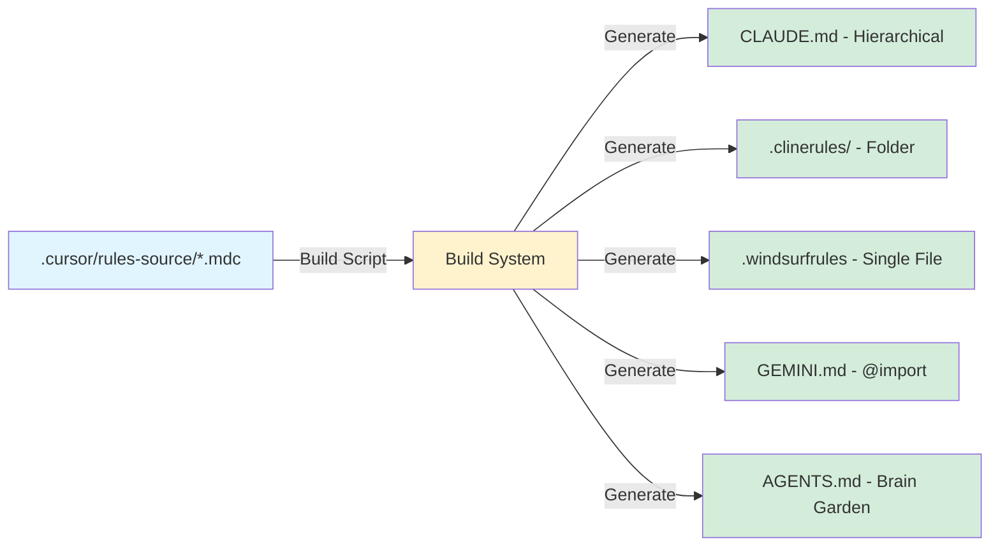
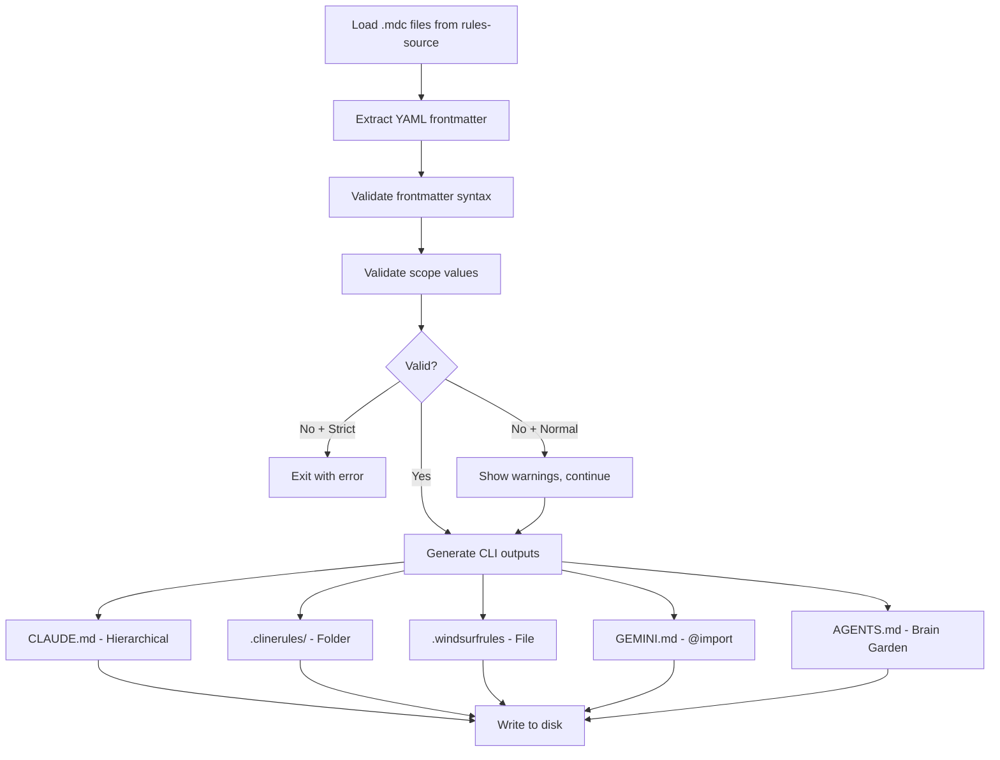

# Rule System Architecture

This document provides comprehensive documentation for the monorepo's rule system, covering architecture, workflows, and CLI-specific usage patterns.

## Table of Contents

1. [Overview](#overview)
2. [Architecture](#architecture)
3. [Rule Categories](#rule-categories)
4. [Frontmatter System](#frontmatter-system)
5. [Build System](#build-system)
6. [CLI-Specific Usage](#cli-specific-usage)
7. [Workflows](#workflows)
8. [Maintenance](#maintenance)
9. [Migration Notes](#migration-notes)
10. [Known Issues & Limitations](#known-issues--limitations)
11. [References](#references)

---

## Overview

### Problem Statement

The original consolidated rules system (10 files) combined multiple concerns into single files, which:
- Made granular updates difficult (editing one concern affected unrelated content)
- Reduced clarity (multiple patterns mixed in one file)
- Limited scope-based filtering (coarse-grained rule activation)
- Complicated maintenance (harder to trace rule origins)

### Solution

The restored rule system addresses these issues by:
- **Restoring 19 original detailed rules** from backup with normalized frontmatter
- **Using intelligent distribution** via build system to generate CLI-specific formats
- **Maintaining single source of truth** in `.cursor/rules-source/` directory
- **Enabling scope-based activation** for context-aware rule loading

### Key Benefits

- **Granularity**: One concern per rule file (easier updates)
- **Clarity**: Clear rule boundaries and purposes
- **Flexibility**: Scope-based filtering for relevant rules only
- **Maintainability**: Simple to add, modify, or remove individual rules
- **CLI-Agnostic**: Single source generates formats for all AI platforms

---

## Architecture

The rule system follows a **source → build → distribute** architecture:



### Directory Structure

```
.cursor/
├── rules-source/              # SOURCE OF TRUTH (19 .mdc files)
│   ├── README.md
│   └── *.rules.mdc            # Individual rule files with YAML frontmatter
├── sync/
│   ├── build-consolidated-rules.ts     # Main build script
│   ├── contexts.ts                     # Shared context definitions
│   └── build-consolidated-rules-and-verify.ts  # Build + verify
└── (generated outputs - DO NOT EDIT)
    ├── /CLAUDE.md             # Root consolidated rules
    ├── /.clinerules/          # Cline folder structure
    ├── /.windsurfrules        # Windsurf single file
    └── /GEMINI.md             # Gemini @import hierarchy

apps/*/CLAUDE.md               # Context-specific rules
packages/*/CLAUDE.md           # Package-specific rules
*/AGENTS.md                    # Brain Garden agent rules
```

### Data Flow

1. **Developer** edits rule in `.cursor/rules-source/`
2. **Build script** (`pnpm rules:build`) reads all `.mdc` files
3. **Validation** checks frontmatter YAML syntax and scope values
4. **Distribution** generates CLI-specific formats based on scopes
5. **Verification** (`pnpm rules:verify`) audits distribution correctness
6. **CLI** loads rules in platform-specific format

---

## Rule Categories

The 19 restored rules are organized into 5 categories:

### 1. Foundation Rules (1 rule)

Core monorepo structure and configuration:

| Rule | Scope | Description |
|------|-------|-------------|
| `monorepo-structure-and-configuration` | `monorepo, global` | ESM-only, no-build libraries, shared config |

**Special:** `alwaysApply: true` - loaded in every context.

### 2. React/Frontend Rules (6 rules)

Component patterns and UI development:

| Rule | Scope | Description |
|------|-------|-------------|
| `atomic-design-component-strategy` | `react, frontend, ui, components` | Wrap third-party UI components |
| `storybook-first-composition` | `react, storybook, ui, components` | Build components in isolation first |
| `mobile-first-design` | `react, frontend, ui, responsive` | Progressive enhancement from mobile |
| `react-bulletproof-component-pattern` | `react, frontend, ui, components` | Comprehensive React standards |
| `component-design-decision-tree` | `react, frontend, ui, components` | Choose the right component pattern |
| `platform-pathways-pattern` | `react, frontend, ui, responsive` | Different mobile/desktop layouts |

### 3. Backend Rules (4 rules)

Server architecture and Node.js patterns:

| Rule | Scope | Description |
|------|-------|-------------|
| `monorepo-node-express-architecture` | `express, backend, api, node, mongodb` | Express.js with functional DI |
| `node.functional-isolated-concerns` | `node, backend, tooling` | Functional patterns for scripts/CLIs |
| `cm-proxy-rules` | `backend, api, proxy, middleware` | Content Manager API proxy patterns |
| `project-wide-proxy-rules` | `backend, api, proxy, middleware` | General proxy and middleware patterns |

### 4. Testing Rules (5 rules)

Validation and testing strategies:

| Rule | Scope | Description |
|------|-------|-------------|
| `tests.tdd-workflow` | `testing, tdd` | 5-step TDD process |
| `tests.continuous-validation` | `testing, validation, monitoring` | Brain monitor integration |
| `tests.unified-testing` | `testing, monorepo` | Unit, integration, and E2E strategy |
| `testid` | `testing, react, frontend` | TestID management conventions |
| `brain-monitor-validation` | `testing, validation, monitoring, global` | Validation workflow and error management |

### 5. Documentation Rules (3 rules)

Documentation and workflow standards:

| Rule | Scope | Description |
|------|-------|-------------|
| `monorepo-documentation-strategy` | `monorepo, global, documentation` | Documentation hierarchy |
| `monorepo-package-docs-versioning` | `monorepo, packages, versioning, documentation` | Package docs and versioning |
| `pr-creation-guidelines` | `monorepo, global, workflow, git` | Pull request workflow |

---

## Frontmatter System

All rule files **must** have valid YAML frontmatter at the top of the file.

### Required Fields

```yaml
---
description: Brief description of what this rule enforces
globs:
  - "pattern/to/match/**/*"    # File patterns this rule applies to
  - "another/pattern/**/*.tsx"  # Can have multiple patterns
scopes:
  - scope1    # Context keywords that trigger this rule
  - scope2    # e.g., react, backend, testing
alwaysApply: false  # true = applies to all files, false = selective
---
```

### Field Definitions

| Field | Type | Required | Description |
|-------|------|----------|-------------|
| `description` | string | Yes | One-line summary of the rule's purpose |
| `globs` | string[] | Yes | Array of glob patterns for file matching (can be empty if `alwaysApply: true`) |
| `scopes` | string[] | Yes | Array of context keywords for intelligent activation |
| `alwaysApply` | boolean | Yes | If `true`, rule applies globally regardless of file patterns |

### Valid Scope Values

The build system validates scopes against a predefined list:

**Architecture & Structure:**
- `monorepo` - Monorepo-wide concerns
- `global` - Applies everywhere
- `shared` - Shared code patterns
- `architecture` - System design decisions

**Frontend:**
- `react` - React components and patterns
- `frontend` - Client-side code
- `ui` - User interface concerns
- `components` - Component development
- `storybook` - Storybook stories
- `vite` - Vite configuration
- `mantine` - Mantine UI library
- `responsive` - Responsive design

**Backend:**
- `express` - Express.js framework
- `backend` - Server-side code
- `api` - API development
- `node` - Node.js specific
- `mongodb` - Database concerns
- `proxy` - Proxy patterns
- `middleware` - Middleware configuration
- `services` - Microservices
- `tooling` - Build tools and scripts

**Testing & Quality:**
- `testing` - All testing concerns
- `tdd` - Test-driven development
- `validation` - Code validation
- `monitoring` - Error monitoring

**Workflow:**
- `git` - Version control
- `workflow` - Development workflow
- `documentation` - Docs and comments
- `versioning` - Package versioning
- `packages` - Package management

**Note:** Unknown scopes trigger warnings but don't fail the build (allows for specialized/experimental scopes).

### Scope Matching Logic

Rules are distributed to contexts based on scope matching:

1. **Special scope `*`**: Includes ALL rules (only used in root context)
2. **No scopes defined**: Rule included everywhere (default to global)
3. **`global` scope**: Rule included in all contexts
4. **Specific scopes**: Rule included if ANY scope matches target context

Example:
```yaml
# Rule with scopes: ['react', 'frontend', 'ui']
# Matches contexts with scopes: ['react', ...], ['frontend', ...], or ['ui', ...]
# Does NOT require all three scopes to match
```

---

## Build System

The build system transforms source rules into CLI-specific formats.

### Build Script

**Location:** `.cursor/sync/build-consolidated-rules.ts`

**Purpose:** Generate all rule distributions from source files.

### Commands

```bash
# Standard build (with warnings)
pnpm rules:build

# Strict mode (warnings = errors)
pnpm rules:build:strict

# Verify distribution correctness
pnpm rules:verify

# Build + verify in one step
pnpm rules:build:verify

# Watch mode (auto-rebuild on changes)
pnpm rules:watch
```

### Build Process



### Validation Checks

The build system performs these validations:

1. **YAML Syntax**: Frontmatter must be valid YAML
2. **Required Fields**: All fields (`description`, `globs`, `scopes`, `alwaysApply`) must be present
3. **Scope Values**: Scopes checked against valid list (warnings for unknown scopes)
4. **Contradictory Flags**: Warns if `alwaysApply: true` but also has specific scopes
5. **Character Limits**: Warns if rules exceed 12K characters (Windsurf/Cline performance)

### What Gets Generated

For each CLI platform, the build system generates:

| Platform | Output | Format | Description |
|----------|--------|--------|-------------|
| **Cursor** | `CLAUDE.md` (hierarchical) | Markdown with TOC | Context-specific rules via symlinks |
| **Cline** | `.clinerules/` folder | Numbered .md files | Meta-instructions + 01-XX rule files |
| **Windsurf** | `.windsurfrules` | Single markdown file | Activation metadata per rule |
| **Gemini** | `GEMINI.md` (hierarchical) | @import directives | Hierarchical loading via imports |
| **Brain Garden** | `AGENTS.md` (hierarchical) | Grouped by core/contextual | Agent-specific format |

---

## CLI-Specific Usage

Each AI platform has unique requirements and usage patterns.

### Cursor

**Format:** Hierarchical `CLAUDE.md` files + symlinks to `.mdc` sources

**Location:**
- Root: `/CLAUDE.md` (all rules)
- Apps: `/apps/*/CLAUDE.md` (scoped to context)
- Packages: `/packages/*/CLAUDE.md` (scoped to context)

**Activation:**
- Cursor reads `.mdc` files **directly** from `.cursor/rules-source/`
- `CLAUDE.md` files are reference documentation (not loaded by Cursor)
- Scope-based activation via file glob patterns in frontmatter

**Usage:**
1. Cursor automatically loads rules based on current file context
2. Rules with matching globs activate when editing those files
3. `alwaysApply: true` rules load in all contexts

**Best Practices:**
- Use `.cursorrules` for agent correction instructions only
- Don't edit `CLAUDE.md` files (auto-generated)
- Modify sources in `.cursor/rules-source/` instead

### Cline

**Format:** Folder structure `.clinerules/` with numbered rule files

**Location:**
- `/.clinerules/00-meta-instructions.md` (rule loading protocol)
- `/.clinerules/01-XX-<rule-name>.md` (individual rules)

**Activation:**
- Cline allows toggling rules on/off via popover menu
- Rules load in numbered order (01-19)
- Meta-instructions explain rule precedence and context management

**Rule File Structure:**
```markdown
# Rule Name

**Metadata:**
- Activation: Always On | Context-Based
- File Patterns: `pattern/**/*.ts`
- Scopes: react, frontend, ui
- Always Apply: Yes | No

---

[Rule content]
```

**Usage:**
1. Enable relevant rules via Cline's rule toggle popover
2. Foundation rules (01-XX) should remain enabled
3. Disable unused rules to conserve context tokens
4. Use `new_task` handoffs at 80% token utilization

**Best Practices:**
- Preload rules for next task domain before context switch
- Monitor character counts (optimal: 2K-8K per rule)
- Use meta-instructions for rule precedence guidance

### Windsurf

**Format:** Single file `.windsurfrules` with activation metadata

**Location:** `/.windsurfrules`

**Activation Modes:**
- **Always On**: `alwaysApply: true` rules
- **Glob-Based**: Rules with file patterns defined
- **Model Decision**: Rules without patterns (LLM decides)

**Metadata Per Rule:**
```markdown
## Rule Name

**Activation:** Always On | Glob-Based | Model Decision
**File Patterns:** `pattern/**/*.ts`, `another/**/*.tsx`
**Scopes:** react, frontend, ui

[Rule content]
```

**Usage:**
1. Windsurf loads rules based on activation mode
2. Glob-based rules activate when editing matching files
3. Model Decision rules load based on LLM context analysis

**Limitations:**
- **12K character limit** for optimal performance
- Large rules (>12K) trigger warnings during build
- Consider splitting large rules into focused sub-rules

**Best Practices:**
- Monitor build warnings for oversized rules
- Use specific glob patterns for precise activation
- Rely on Model Decision for complex scenarios

### Gemini

**Format:** Hierarchical `GEMINI.md` files with `@import` directives

**Location:**
- Root: `/GEMINI.md` (foundation rules via @import)
- Apps: `/apps/*/GEMINI.md` (@import context rules)
- Packages: `/packages/*/GEMINI.md` (@import context rules)

**Import Strategy:**
```markdown
# Monorepo Development Rules

## Foundation Rules (Always Loaded)

@.cursor/rules-source/monorepo-structure-and-configuration.rules.mdc
@.cursor/rules-source/brain-monitor-validation.rules.mdc

## Context-Specific Rules

Navigate to specific contexts (apps, packages) to access context-specialized rules.
```

**Activation:**
- Gemini loads rules hierarchically via `@import` directives
- Foundation rules imported at root level
- Context rules imported in subdirectories
- Relative paths from each `GEMINI.md` location

**Usage:**
1. Start with root `GEMINI.md` for foundation rules
2. Navigate to context-specific `GEMINI.md` for specialized rules
3. Gemini resolves `@import` paths relative to current file

**Best Practices:**
- Use hierarchical loading (root → context → specific)
- Avoid circular imports (build validates)
- Relative paths ensure portability

---

## Workflows

### Adding a New Rule

**Step-by-step:**

1. **Create rule file** in `.cursor/rules-source/`:
   ```bash
   touch .cursor/rules-source/my-new-rule.rules.mdc
   ```

2. **Add YAML frontmatter** (all fields required):
   ```yaml
   ---
   description: Brief description of what this rule enforces
   globs:
     - "path/to/files/**/*.ts"
   scopes:
     - scope1
     - scope2
   alwaysApply: false
   ---
   ```

3. **Write rule content** in Markdown:
   ```markdown
   # My New Rule

   ## Overview
   [Explain the rule]

   ## Examples
   [Provide examples]
   ```

4. **Build and verify**:
   ```bash
   pnpm rules:build:verify
   ```

5. **Check distribution**:
   - Verify rule appears in expected `CLAUDE.md` files
   - Check `.clinerules/` has new numbered file
   - Confirm `.windsurfrules` includes rule
   - Validate `GEMINI.md` imports are correct

6. **Test activation**:
   - Edit a file matching the glob pattern
   - Verify rule activates in Cursor/Cline/etc.

### Modifying an Existing Rule

**Step-by-step:**

1. **Edit source file** in `.cursor/rules-source/`:
   ```bash
   vim .cursor/rules-source/existing-rule.rules.mdc
   ```

2. **Update content** (ensure frontmatter stays valid):
   - Modify rule body as needed
   - Update `description` if purpose changed
   - Adjust `globs` if file patterns changed
   - Update `scopes` if context changed

3. **Rebuild**:
   ```bash
   pnpm rules:build:verify
   ```

4. **Verify changes** propagated:
   - Check generated `CLAUDE.md` files
   - Confirm `.clinerules/` updated
   - Validate `.windsurfrules` reflects changes

### Testing Rule Distribution

**Verification workflow:**

1. **Run verification script**:
   ```bash
   pnpm rules:verify
   ```

2. **Interpret output**:
   ```
   ✅ Correct Distribution (12 contexts):
      ✓ apps/client: 15/15 rules

   ⚠️  Over-Distribution (1 context):
      ⚠  apps/server:
         Has unexpected: rule-name

   ❌ Under-Distribution (1 context):
      ✗ packages/shared-ui:
         Missing: rule-name
   ```

3. **Common issues**:
   - **Over-distribution**: Rule has scopes that don't match context (check frontmatter)
   - **Under-distribution**: Rule scopes don't match expected context (add scope or adjust context)
   - **Both**: Frontmatter scopes conflict with context definitions

4. **Fix and rebuild**:
   ```bash
   # Edit frontmatter in source file
   vim .cursor/rules-source/problematic-rule.rules.mdc

   # Rebuild and verify
   pnpm rules:build:verify
   ```

### Troubleshooting Common Issues

See [RULES_TROUBLESHOOTING.md](./RULES_TROUBLESHOOTING.md) for detailed troubleshooting guidance.

---

## Maintenance

### When to Rebuild Rules

Rebuild rules (`pnpm rules:build`) when:

- Adding a new rule file to `.cursor/rules-source/`
- Modifying existing rule content or frontmatter
- Changing scope values in frontmatter
- Updating glob patterns
- Modifying context definitions in `contexts.ts`
- After pulling updates that change rules

### How to Verify Distribution

Use the verification workflow:

```bash
# Quick verification
pnpm rules:verify

# Full build + verify
pnpm rules:build:verify

# Watch mode (auto-rebuild on changes)
pnpm rules:watch
```

**Verification checks:**
- All expected rules present in each context
- No unexpected rules in contexts
- Rule distribution matches scope definitions
- YAML frontmatter is valid

### CI/CD Integration Recommendations

**Option 1: Pre-commit hook**
```bash
# .husky/pre-commit
pnpm rules:build:verify || {
  echo "Rule distribution verification failed!"
  echo "Run 'pnpm rules:build' to regenerate."
  exit 1
}
```

**Option 2: GitHub Actions**
```yaml
- name: Verify rule distribution
  run: pnpm rules:verify

- name: Check generated files are up-to-date
  run: |
    pnpm rules:build
    git diff --exit-code || {
      echo "Generated rule files are out of sync!"
      exit 1
    }
```

**Option 3: Manual PR checklist**
```markdown
- [ ] Run `pnpm rules:build:verify` before committing
- [ ] Verify rule distribution is correct
- [ ] Update CHANGELOG if rules changed
```

### Keeping Rules Up-to-Date

**Best practices:**

1. **Document rule changes** in CHANGELOG.md:
   ```markdown
   ### [Unreleased]
   #### Changed
   - Updated `react-bulletproof-component-pattern` rule to include new hooks guidance
   ```

2. **Review rules quarterly** for relevance:
   - Remove obsolete rules
   - Update outdated patterns
   - Add new emerging patterns

3. **Test rules with new team members**:
   - Do rules make sense without context?
   - Are examples still accurate?
   - Is terminology clear?

4. **Version control rules** with semantic versioning:
   - MAJOR: Breaking changes to rule structure
   - MINOR: New rules added
   - PATCH: Rule content updates/fixes

---

## Migration Notes

### What Changed from Consolidated to Restored System

**Before (Consolidated):**
- 10 consolidated rule files
- Multiple concerns per file
- Coarse-grained scope activation
- Harder to update individual patterns

**After (Restored):**
- 19 original detailed rules
- One concern per file
- Fine-grained scope-based activation
- Easy to update individual rules

### Timeline

- **Original system**: 19 detailed .mdc files in `.cursor/rules/`
- **Consolidation**: Created 10 consolidated files (lost detail)
- **Backup**: Original 19 files backed up to `.cursor/_backup/`
- **Restoration**: Restored 19 files to `.cursor/rules-source/`
- **Build system**: Created automated distribution system
- **Current**: 19 source files → multiple CLI formats

### How to Update Workflows

**Old workflow:**
```bash
# Edit consolidated rule directly
vim .cursor/rules/01-foundation.rules.mdc

# No build step needed
```

**New workflow:**
```bash
# Edit source rule
vim .cursor/rules-source/monorepo-structure-and-configuration.rules.mdc

# Build and verify
pnpm rules:build:verify
```

### Backward Compatibility Considerations

**Fully backward compatible:**
- Generated `CLAUDE.md` files maintain same structure
- `.clinerules/` folder replaces `.clinerules` file (seamless)
- `.windsurfrules` format unchanged
- `GEMINI.md` uses same @import mechanism

**No breaking changes:**
- Existing rule content unchanged (restored from originals)
- Frontmatter fields standardized but content identical
- CLI platforms continue working without changes

**Migration checklist:**
- [ ] Pull latest changes from repo
- [ ] Run `pnpm rules:build` to regenerate all outputs
- [ ] Verify your CLI loads rules correctly
- [ ] Update bookmarks to `.cursor/rules-source/` (not `.cursor/rules/`)

---

## Known Issues & Limitations

### 1. Under-Distribution Warnings (Cosmetic)

**Issue:** Verification script reports "under-distribution" for some rules.

**Cause:** Rule names in source files vs. generated `AGENTS.md` files may differ slightly (e.g., `tests.tdd-workflow` vs `tdd-workflow`).

**Impact:** Cosmetic only - rules are correctly distributed, just naming mismatch in verification.

**Workaround:** Safe to ignore if manual inspection confirms rule is present.

**Fix planned:** Normalize rule name extraction in verification script.

### 2. 12K Character Warnings

**Issue:** Build warns when rules exceed 12,000 characters.

**Cause:** Windsurf and Cline have performance degradation with large rules.

**Impact:** Rule still works, but may slow down CLI loading.

**Workaround:** Consider splitting large rules into focused sub-rules:
```
tests.unified-testing.rules.mdc (12K+ chars)
↓ Split into:
tests.unit-testing.rules.mdc (4K chars)
tests.integration-testing.rules.mdc (4K chars)
tests.e2e-testing.rules.mdc (4K chars)
```

**Not a blocker:** Warning is informational, not an error.

### 3. Unknown Scope Warnings

**Issue:** Build warns about scopes not in the predefined list.

**Cause:** Rule uses specialized or experimental scope values.

**Impact:** None if intentional (e.g., `proxy`, `middleware` are specialized).

**Expected for:**
- Domain-specific scopes (e.g., `cm-proxy`, `flight-boards`)
- Experimental features
- Plugin-specific scopes

**Workaround:** Add scope to `VALID_SCOPES` array in build script if it's a common pattern.

### 4. Cursor .mdc Direct Loading

**Issue:** Cursor reads `.mdc` files directly, not `CLAUDE.md`.

**Cause:** Cursor's native support for modular rules.

**Impact:** `CLAUDE.md` files are documentation only for Cursor users.

**Clarification:**
- `CLAUDE.md` = human-readable reference
- `.mdc` files = Cursor's actual rule source
- Other CLIs use generated formats (`.clinerules/`, `.windsurfrules`, etc.)

---

## References

### Key Files

| File | Purpose |
|------|---------|
| `.cursor/rules-source/README.md` | Source rule documentation |
| `.cursor/sync/build-consolidated-rules.ts` | Main build script |
| `.cursor/sync/contexts.ts` | Shared context definitions |
| `scripts/verify-rule-distribution.ts` | Distribution verification |
| `docs/maintenance/RULES_MIGRATION_GUIDE.md` | Migration documentation |
| `docs/maintenance/RULES_TROUBLESHOOTING.md` | Troubleshooting guide |

### Build System Locations

- **Build script**: `.cursor/sync/build-consolidated-rules.ts`
- **Verification script**: `scripts/verify-rule-distribution.ts`
- **Context definitions**: `.cursor/sync/contexts.ts`
- **Source rules**: `.cursor/rules-source/*.mdc`

### Generated Outputs

- **Root CLAUDE.md**: `/CLAUDE.md`
- **Context CLAUDE.md**: `/apps/*/CLAUDE.md`, `/packages/*/CLAUDE.md`, etc.
- **Cline rules**: `/.clinerules/00-meta-instructions.md`, `/.clinerules/01-XX-*.md`
- **Windsurf rules**: `/.windsurfrules`
- **Gemini rules**: `/GEMINI.md`, `/apps/*/GEMINI.md`, etc.
- **Brain Garden rules**: `/AGENTS.md`, `/apps/*/AGENTS.md`, etc.

### CLI Documentation

- **Cursor**: [Cursor AI Documentation](https://cursor.sh/docs)
- **Cline**: [Cline Documentation](https://github.com/cline/cline)
- **Windsurf**: [Windsurf Documentation](https://codeium.com/windsurf)
- **Gemini**: [Google Gemini Code Assist](https://cloud.google.com/gemini/docs/codeassist)

### Related Documentation

- [AGENT_INSTRUCTIONS.md](./AGENT_INSTRUCTIONS.md) - Comprehensive agent guide
- [DOCUMENTATION_STANDARDS.md](./DOCUMENTATION_STANDARDS.md) - Documentation conventions
- [RULES_MIGRATION_GUIDE.md](./RULES_MIGRATION_GUIDE.md) - Transition guide
- [RULES_TROUBLESHOOTING.md](./RULES_TROUBLESHOOTING.md) - Troubleshooting reference

---

**Last Updated:** 2025-10-22
**Version:** 1.0.0
**Maintained By:** Development Team
