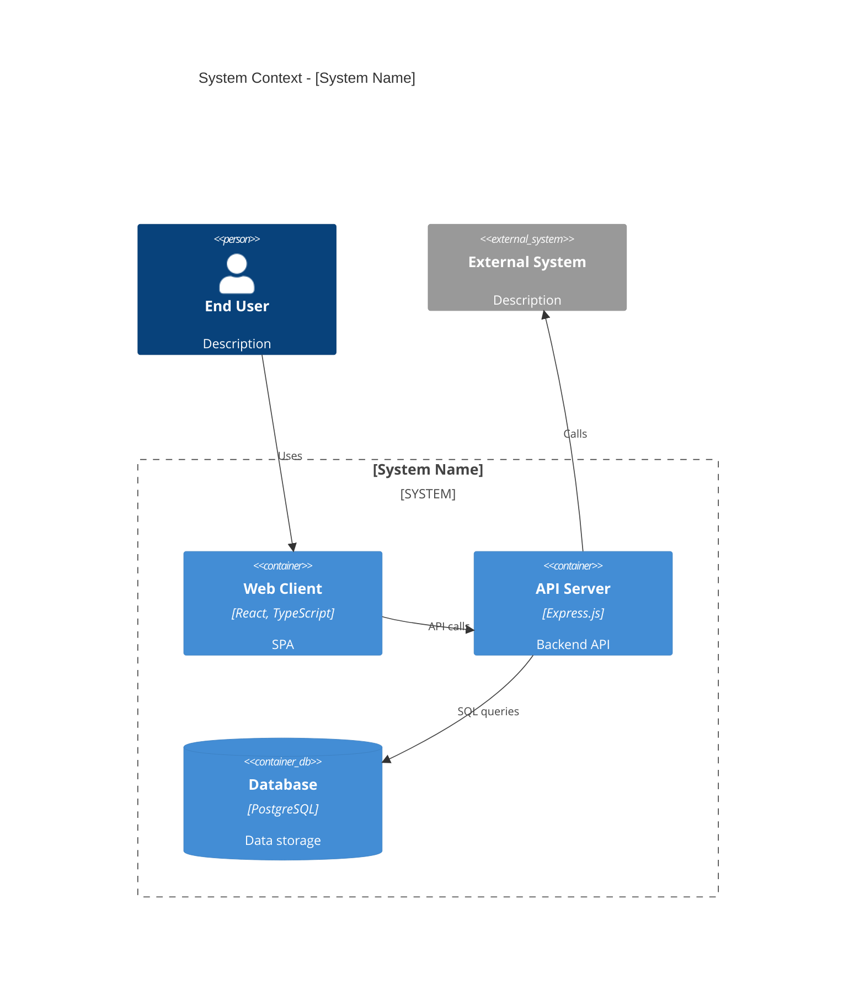
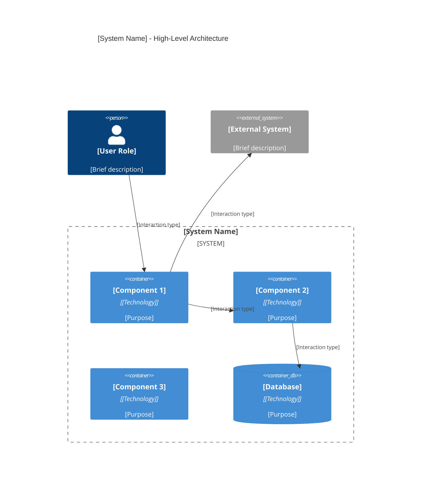
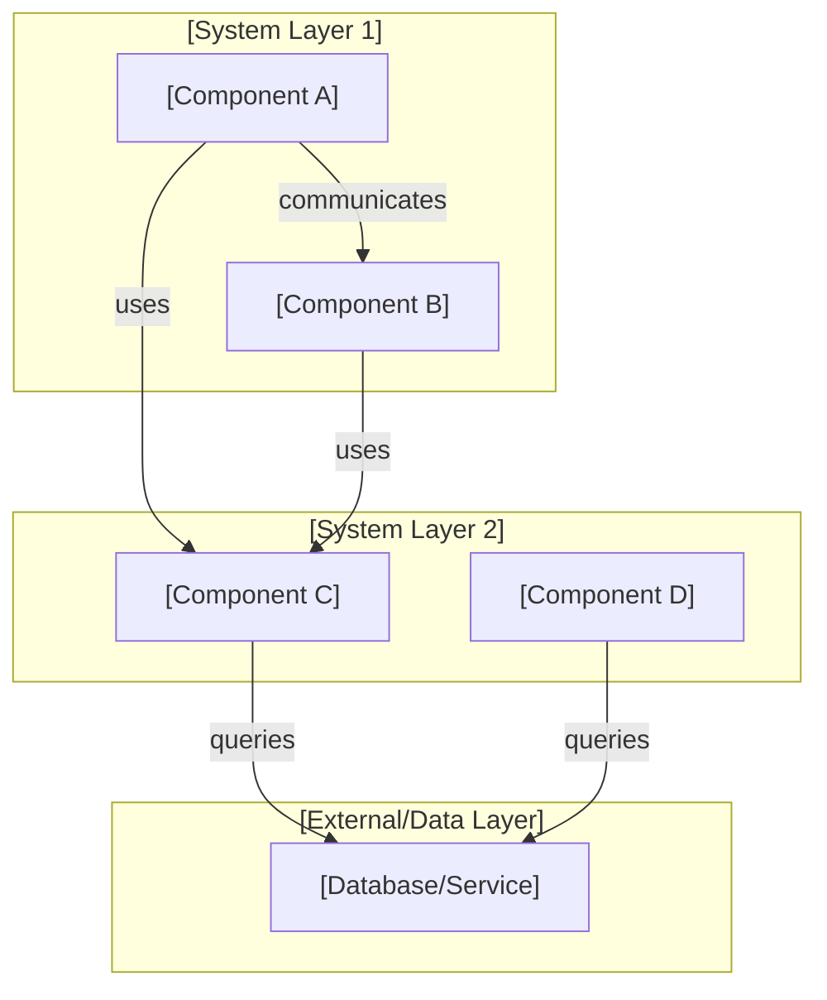
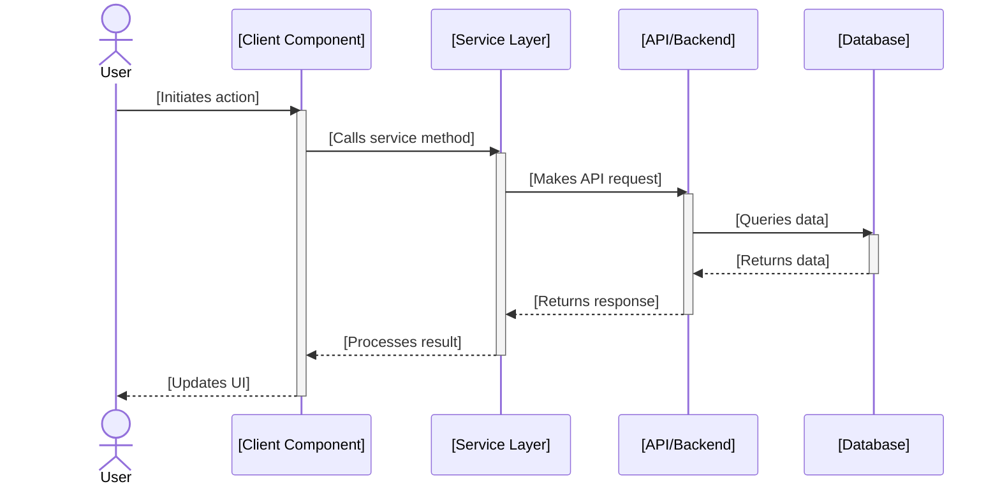

<!--
Architecture Document Template v2.0
Based on BMAD Method Fullstack Architecture template

Instructions:
1. Copy this template to create a new architecture document
2. Replace all [PLACEHOLDER] text with actual content
3. Update YAML frontmatter with appropriate values
4. Fill in all sections completely
5. Include Mermaid diagrams where specified
6. Remove this instruction block when done

For examples, see:
- docs/architecture/system-overview.md
- docs/architecture/frontend.md
- docs/architecture/backend.md
-->

---
title: "[Component/System Name] Architecture"
description: "[Brief description of what this architecture document covers - 1 sentence]"
keywords: [architecture, [component], [technology], [pattern]]
last_updated: "YYYY-MM-DD"
---

# [Component/System Name] Architecture

## Overview

<!-- 2-3 paragraphs introducing the architecture being documented:
- What is the component/system and its purpose?
- What problem does it solve?
- High-level characteristics
- Key stakeholders and users

Example: "The frontend is a modern React 18.3 single-page application (SPA) built for enterprise content management..."
-->

[Paragraph 1: Component purpose and strategic context]

[Paragraph 2: Key characteristics and design principles]

[Paragraph 3: Intended users and primary use cases]

---

## Technology Stack

<!-- Table of all technologies used in this component
Include: Component name, Technology, Version, Purpose/Role
Helps team members understand the complete tech landscape
-->

| Component | Technology | Version | Purpose |
|-----------|-----------|---------|---------|
| [Layer 1] | [Technology] | [x.x.x] | [Purpose/responsibility] |
| [Layer 2] | [Technology] | [x.x.x] | [Purpose/responsibility] |
| [Layer 3] | [Technology] | [x.x.x] | [Purpose/responsibility] |
| [Testing] | [Framework] | [x.x.x] | [Purpose/responsibility] |
| [Build Tools] | [Tool] | [x.x.x] | [Purpose/responsibility] |

---

## High-Level Architecture

### Technical Summary

<!-- 2-3 paragraphs describing the architecture at a high level:
- Major architectural patterns used
- Key design decisions
- How major components interact
- Separation of concerns

Example: "The frontend uses a modular, component-driven architecture with Redux for centralized state management and RTK Query for server-side data synchronization. Components are organized in atomic design levels..."
-->

[Paragraph 1: Architectural patterns and approach]

[Paragraph 2: Key design decisions and rationale]

[Paragraph 3: How components interact at high level]

### Architecture Diagram

<!-- High-level Mermaid diagram showing the overall architecture.
This is typically a C4 Container diagram or similar showing major components and their relationships.

Example C4 Container diagram:


Alternatively use a simpler diagram format appropriate to your architecture.
-->



### Architectural Patterns

<!-- Describe the key architectural patterns employed:
- Layered architecture
- MVC/MVVM
- Event-driven
- Plugin architecture
- etc.

List patterns and explain why they were chosen.
-->

- **[Pattern 1 Name]**: [Explanation of how it's used and why]
- **[Pattern 2 Name]**: [Explanation of how it's used and why]
- **[Pattern 3 Name]**: [Explanation of how it's used and why]

---

## Component Structure

### Directory Organization

<!-- Describe the file and directory structure:
- How is the codebase organized?
- What is the purpose of each major directory?
- Where do specific types of files go?

Example:
```
frontend/
├─ src/
│  ├─ components/
│  │  ├─ atoms/
│  │  ├─ molecules/
│  │  └─ organisms/
│  ├─ pages/
│  ├─ services/
│  └─ styles/
├─ public/
├─ tests/
└─ package.json
```
-->

```
[Component/App Name]/
├─ [Major Directory 1]/
│  ├─ [Subdirectory]/
│  │  └─ [Files]
│  └─ [Subdirectory]/
├─ [Major Directory 2]/
│  └─ [Subdirectory]/
├─ [Major Directory 3]/
└─ [Configuration Files]
```

**Key Directories:**

- **[Directory]**: [Purpose and contents]
- **[Directory]**: [Purpose and contents]
- **[Directory]**: [Purpose and contents]

### Key Components and Responsibilities

<!-- Describe the major components and what each is responsible for:
- Component name and location
- Primary responsibility
- Key exports or interfaces
- Dependencies

Example:
"**App.tsx** - Root component that orchestrates the entire application
- Initializes Redux store and theme
- Sets up React Router for navigation
- Wraps child components with providers
- Location: src/App.tsx"
-->

#### [Component 1 Name]

**Location:** [File path]

**Responsibility:** [What this component does and why it matters]

**Key Exports:** [Main functions, classes, or types]

**Dependencies:** [What this component depends on]

#### [Component 2 Name]

**Location:** [File path]

**Responsibility:** [What this component does and why it matters]

**Key Exports:** [Main functions, classes, or types]

**Dependencies:** [What this component depends on]

#### [Component 3 Name]

**Location:** [File path]

**Responsibility:** [What this component does and why it matters]

**Key Exports:** [Main functions, classes, or types]

**Dependencies:** [What this component depends on]

### Component Diagram

<!-- Mermaid diagram showing relationships between major components
This could be a C4 Component diagram or simpler graph
-->



---

## Data Flow

### Data Flow Description

<!-- Describe how data flows through the system:
- How does data enter the system?
- What transformations occur?
- How is state managed?
- Where is data persisted?
- What is the typical request/response cycle?

Example: "User authentication data flows from the login form to the API, which validates credentials and returns a JWT token. The token is stored in localStorage and Redux state, then included in subsequent API requests..."
-->

[Description of data entry points and initial processing]

[Description of data transformations and processing]

[Description of state management and persistence]

[Description of typical request/response cycle]

### Sequence Diagram

<!-- Mermaid sequence diagram showing a typical data flow through the system
Include key actors (User, Component, Service, Database) and their interactions
-->



---

## API/Interface Specification

<!-- REQUIRED if this component exposes an API; OPTIONAL if internal only
Include endpoints, methods, request/response formats, error handling
-->

### Endpoints/Methods

<!-- List all public API endpoints or exported functions -->

#### [Endpoint/Method 1]

**Path/Method:** `[GET/POST] /api/[resource]`

**Purpose:** [What this endpoint does]

**Request Parameters:**
```json
{
  "param1": "[type] - [description]",
  "param2": "[type] - [description]"
}
```

**Response Format:**
```json
{
  "success": boolean,
  "data": {
    "field1": "[type] - [description]",
    "field2": "[type] - [description]"
  }
}
```

**Status Codes:**
- `200 OK` - [Condition]
- `400 Bad Request` - [Condition]
- `401 Unauthorized` - [Condition]
- `500 Internal Server Error` - [Condition]

#### [Endpoint/Method 2]

**Path/Method:** `[GET/POST] /api/[resource]`

**Purpose:** [What this endpoint does]

**Request Parameters:**
```json
{
  "param1": "[type] - [description]"
}
```

**Response Format:**
```json
{
  "success": boolean,
  "data": [...]
}
```

### Error Handling

<!-- Describe error handling strategy and conventions -->

**Error Response Format:**
```json
{
  "error": {
    "code": "[ERROR_CODE]",
    "message": "[Human-readable error message]",
    "details": "[Additional context if applicable]"
  }
}
```

**Common Error Codes:**
- `[ERROR_CODE_1]` - [Description]
- `[ERROR_CODE_2]` - [Description]
- `[ERROR_CODE_3]` - [Description]

---

## Configuration

### Environment Variables

<!-- List all environment variables used by this component
Include: variable name, purpose, example value, required/optional
-->

| Variable | Purpose | Example | Required |
|----------|---------|---------|----------|
| `[VAR_NAME_1]` | [Purpose] | `value` | Yes / No |
| `[VAR_NAME_2]` | [Purpose] | `value` | Yes / No |
| `[VAR_NAME_3]` | [Purpose] | `value` | Yes / No |

### Configuration Files

<!-- List and describe configuration files used by this component -->

- **[config-file.json]** - [Purpose and location]
- **[.env.example]** - [Purpose and how to use]
- **[tsconfig.json]** - [Purpose]

### Defaults and Overrides

<!-- Describe the configuration hierarchy and precedence -->

Configuration precedence (highest to lowest):
1. Environment variables
2. Command-line arguments
3. Configuration files
4. Hard-coded defaults

---

## Security Considerations

### Authentication and Authorization

<!-- Describe authentication and authorization mechanisms:
- How are users authenticated?
- How are permissions/roles enforced?
- Token management
- Session handling
-->

**Authentication Method:** [OAuth/JWT/API Keys/etc]

- [Authentication detail 1]
- [Authentication detail 2]

**Authorization Model:** [Role-based/Attribute-based/etc]

- [Authorization detail 1]
- [Authorization detail 2]

### Data Protection

<!-- Describe data protection measures:
- Encryption in transit
- Encryption at rest
- Data classification
- Sensitive data handling
-->

- **In Transit:** [TLS/HTTPS/etc - version and cipher suites]
- **At Rest:** [Encryption method if applicable]
- **Sensitive Data:** [How PII/credentials are handled]

### Security Best Practices

<!-- List security measures and considerations -->

- [Security practice 1]
- [Security practice 2]
- [Security practice 3]

---

## Performance Considerations

### Optimization Strategies

<!-- Describe performance optimization approaches:
- Code optimization techniques
- Asset optimization
- Query optimization
- etc.
-->

- **[Optimization 1]**: [Description and rationale]
- **[Optimization 2]**: [Description and rationale]
- **[Optimization 3]**: [Description and rationale]

### Caching

<!-- Describe caching strategy and implementation -->

- **Client-Side Caching:** [Strategy and TTL]
- **Server-Side Caching:** [Strategy and TTL]
- **Cache Invalidation:** [How cache is cleared]

### Scalability

<!-- Describe how the system scales:
- Horizontal vs vertical scaling
- Load balancing
- Database scaling
- Rate limiting
-->

**Scaling Strategy:**

- [Scalability consideration 1]
- [Scalability consideration 2]
- [Performance target/SLA]

---

## Testing Strategy

### Unit Tests

<!-- Describe unit testing approach:
- What is tested at unit level?
- Testing framework and tools
- Coverage targets
- Location of test files
-->

**Framework:** [Vitest/Jest/etc]

**Location:** [Directory where unit tests live]

**Coverage Target:** [Percentage or areas of focus]

**Key Test Areas:**
- [Component/function 1]
- [Component/function 2]

### Integration Tests

<!-- Describe integration testing approach:
- What systems are integrated and tested?
- Testing methodology
- Location of test files
- Key scenarios
-->

**Framework:** [Vitest/Playwright/Cypress/etc]

**Location:** [Directory where integration tests live]

**Key Integration Tests:**
- [Scenario 1 - what is being tested]
- [Scenario 2 - what is being tested]

### End-to-End Tests

<!-- Describe E2E testing approach:
- User workflows tested
- Testing framework
- Test environments
- Critical path coverage
-->

**Framework:** [Playwright/Cypress/etc]

**Location:** [Directory where E2E tests live]

**Critical Workflows Tested:**
- [User workflow 1]
- [User workflow 2]

---

## Development Workflow

### Local Setup

<!-- Step-by-step instructions for developers to set up the component locally -->

1. **Clone Repository**
   ```bash
   git clone [repository-url]
   cd [component-directory]
   ```

2. **Install Dependencies**
   ```bash
   pnpm install
   ```

3. **Configure Environment**
   ```bash
   cp .env.example .env.local
   # Edit .env.local with your configuration
   ```

4. **Start Development Server**
   ```bash
   pnpm dev
   ```

5. **Verify Setup**
   - Application runs at `http://localhost:[PORT]`
   - All tests pass: `pnpm test`

### Build Process

<!-- Describe how the component is built -->

**Build Command:** `pnpm build`

**Build Output:** [Where built artifacts are placed]

**Build Configuration:** [Location of config file if applicable]

**Build Steps:**
1. [Step 1]
2. [Step 2]
3. [Step 3]

### Debugging

<!-- Debugging tools and techniques -->

**Development Tools:**
- [Tool 1 and how to use it]
- [Tool 2 and how to use it]

**Common Issues and Solutions:**
- [Issue 1 - solution]
- [Issue 2 - solution]

---

## Deployment

### Build Artifacts

<!-- Describe what gets deployed -->

**Artifacts Produced:**
- [Artifact 1 - description]
- [Artifact 2 - description]

**Artifact Location:** [Where built files are stored]

### Deployment Process

<!-- Step-by-step deployment instructions -->

**Deployment Steps:**

1. [Step 1 - build or prepare]
2. [Step 2 - package]
3. [Step 3 - deploy]
4. [Step 4 - verify]

**Deployment Environments:**
- **Development:** [Dev environment details]
- **Staging:** [Staging environment details]
- **Production:** [Production environment details]

### Environment-Specific Configuration

<!-- Describe how configuration differs across environments -->

| Environment | [Config Item 1] | [Config Item 2] | [Config Item 3] |
|-------------|---|---|---|
| Development | [Value] | [Value] | [Value] |
| Staging | [Value] | [Value] | [Value] |
| Production | [Value] | [Value] | [Value] |

---

## Monitoring & Observability

### Logging

<!-- Describe logging strategy:
- What gets logged?
- Log levels and format
- Log destinations
- Retention policy
-->

**Log Levels:** DEBUG, INFO, WARN, ERROR

**Log Format:** [JSON/Plain text/etc]

**Logged Events:**
- [Event type 1 - what and when]
- [Event type 2 - what and when]

**Log Destinations:** [Where logs are stored/aggregated]

### Metrics

<!-- Describe what metrics are collected and monitored -->

**Key Metrics:**
- [Metric 1 - purpose and collection method]
- [Metric 2 - purpose and collection method]
- [Metric 3 - purpose and collection method]

### Health Checks

<!-- Describe health check mechanisms -->

**Health Check Endpoint:** `GET /health`

**Check Frequency:** [How often health is checked]

**Components Checked:**
- [Component 1 status]
- [Component 2 status]

---

## Cross-References

<!-- Link to related documentation for traceability and context -->

### Related Architecture Docs
- [Link to related architecture document 1]
- [Link to related architecture document 2]

### Code Locations
- [Link to code repository or key files]
- [Link to tests directory]
- [Link to config files]

### Architectural Decision Records (ADRs)
- [Link to relevant ADR 1](../decisions/ADR-NNN-title.md)
- [Link to relevant ADR 2](../decisions/ADR-NNN-title.md)

### External References
- [External documentation or standards if applicable]

---

**Document Status:** [DRAFT | IN REVIEW | APPROVED | PUBLISHED]
**Last Updated:** YYYY-MM-DD by [Author Name]
**Next Review Date:** YYYY-MM-DD
