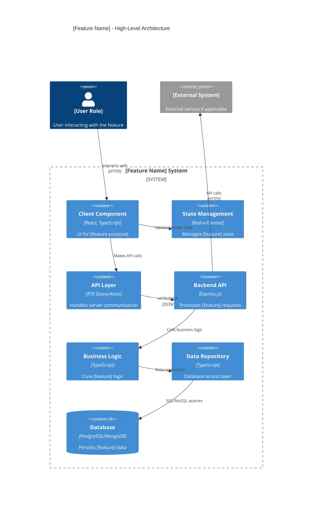
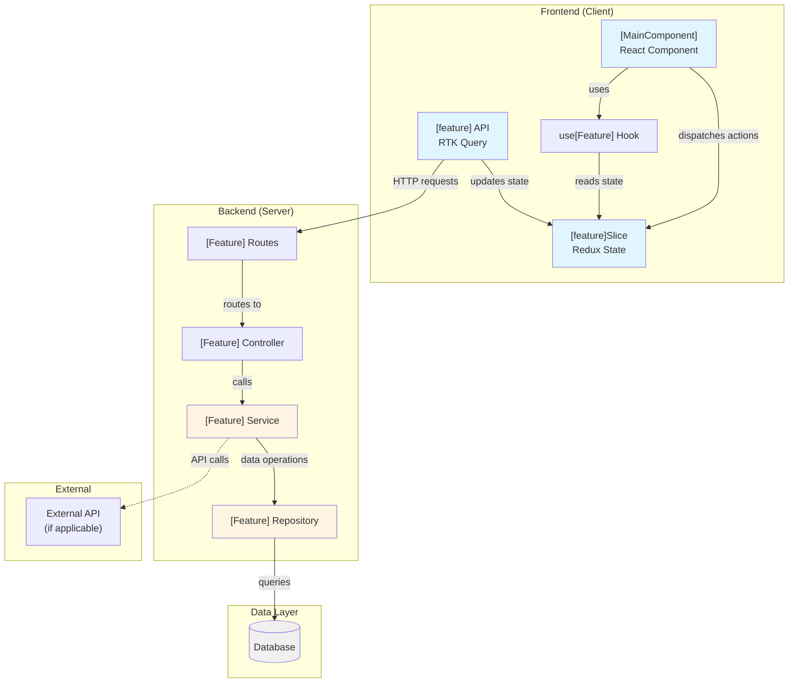
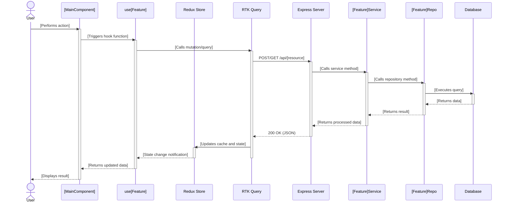
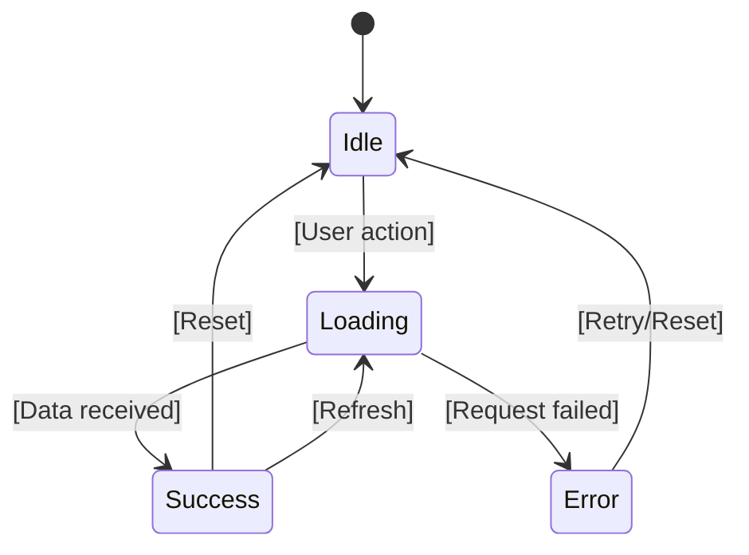

<!--
Feature Architecture Template v1.0

Instructions:
1. Copy this file when documenting a new feature's architecture
2. Replace all [PLACEHOLDER] text with actual content
3. Update YAML frontmatter with appropriate values
4. Fill in all sections completely
5. Customize Mermaid diagrams to match your feature's architecture
6. Link to actual code files using format: `path/to/file.ts:line`
7. Remove this instruction block when done

For reference implementation, see: /docs/features/authentication/architecture.md
-->

---
title: "[Feature Name] Architecture"
description: "[Brief description of the feature's technical architecture]"
keywords: [[feature-name], architecture, [technology], [pattern]]
last_updated: "YYYY-MM-DD"
---

# [Feature Name] Architecture

## Overview

<!-- 2-3 paragraphs introducing the feature's architecture:
- What is the feature and its technical purpose?
- Key architectural characteristics
- Primary design goals and principles -->

[Paragraph 1: Feature purpose and technical context]

[Paragraph 2: Key architectural characteristics and design approach]

[Paragraph 3: Primary design goals - performance, maintainability, scalability, etc.]

---

## Technology Stack

<!-- Table of all technologies used in this feature
Include versions, purpose, and why each was chosen -->

| Component | Technology | Version | Purpose |
|-----------|-----------|---------|---------|
| Frontend UI | [Framework] | [x.x.x] | [UI rendering and user interaction] |
| State Management | [Library] | [x.x.x] | [State handling approach] |
| API Client | [Library] | [x.x.x] | [Server communication] |
| Backend API | [Framework] | [x.x.x] | [Server-side logic] |
| Data Access | [Library/ORM] | [x.x.x] | [Database interaction] |
| Database | [Database] | [x.x.x] | [Data persistence] |
| Authentication | [Library] | [x.x.x] | [Auth mechanism] |
| Testing | [Framework] | [x.x.x] | [Testing approach] |
| Validation | [Library] | [x.x.x] | [Data validation] |

---

## High-Level Architecture

### Technical Summary

<!-- 2-3 paragraphs describing the architecture at a high level:
- Major architectural patterns used (layered, MVC, microservices, etc.)
- Key design decisions and rationale
- How major components interact and communicate
- Separation of concerns approach -->

[Paragraph 1: Overall architectural pattern and structure]

[Paragraph 2: Key design decisions and their rationale]

[Paragraph 3: Component interaction and communication patterns]

### Architecture Diagram

<!-- High-level C4 Container diagram showing the feature's major components
Customize this template to match your feature's architecture -->



### Design Patterns

<!-- Describe the key design patterns employed and why they were chosen -->

#### Pattern 1: [Pattern Name]
**Usage:** [How this pattern is used in the feature]

**Rationale:** [Why this pattern was chosen]

**Implementation:** `[path/to/file.ts:line]` - [Key implementation details]

---

#### Pattern 2: [Pattern Name]
**Usage:** [How this pattern is used in the feature]

**Rationale:** [Why this pattern was chosen]

**Implementation:** `[path/to/file.ts:line]` - [Key implementation details]

---

#### Pattern 3: [Pattern Name]
**Usage:** [How this pattern is used in the feature]

**Rationale:** [Why this pattern was chosen]

**Implementation:** `[path/to/file.ts:line]` - [Key implementation details]

---

---

## Component Structure

### Directory Organization

<!-- Describe the file and directory structure for this feature
Show where components live across packages and apps -->

```
Feature Components Across Monorepo:

packages/[package-name]/src/
├─ components/
│  ├─ [FeatureComponent]/
│  │  ├─ [FeatureComponent].tsx
│  │  ├─ [FeatureComponent].test.tsx
│  │  ├─ [FeatureComponent].stories.tsx
│  │  └─ index.ts
│  └─ [SubComponent]/
│     └─ [files...]
├─ hooks/
│  └─ use[Feature].ts
└─ services/
   └─ [feature]Service.ts

packages/shared-redux/src/
├─ slices/
│  └─ [feature]/
│     ├─ [feature]Slice.ts
│     ├─ [feature]Selectors.ts
│     └─ types.ts
└─ services/
   └─ [feature].ts (RTK Query)

apps/server/src/
├─ modules/
│  └─ [feature]/
│     ├─ [feature].controller.ts
│     ├─ [feature].service.ts
│     ├─ [feature].repo.ts
│     ├─ [feature].types.ts
│     └─ index.ts
└─ routes/
   └─ [feature].routes.ts
```

**Key Directories:**

- **Client Components** (`packages/[package-name]/src/components/`) - UI components for the feature
- **State Management** (`packages/shared-redux/src/slices/[feature]/`) - Redux slice and selectors
- **API Services** (`packages/shared-redux/src/services/[feature].ts`) - RTK Query endpoints
- **Backend Module** (`apps/server/src/modules/[feature]/`) - Server-side implementation
- **Routes** (`apps/server/src/routes/[feature].routes.ts`) - API route definitions

### Key Components and Responsibilities

<!-- Describe the major components and their roles -->

#### Frontend Layer

##### [MainComponent] Component
**Location:** `packages/[package-name]/src/components/[MainComponent]/[MainComponent].tsx`

**Responsibility:** [Primary UI component purpose and functionality]

**Key Features:**
- [Feature 1]
- [Feature 2]
- [Feature 3]

**Props Interface:**
```typescript
interface [MainComponent]Props {
  [prop1]: [type]; // [description]
  [prop2]: [type]; // [description]
  [prop3]?: [type]; // [optional - description]
}
```

**Dependencies:**
- `use[Feature]` hook - [Purpose]
- `[feature]Slice` actions - [Purpose]

---

##### [SubComponent] Component
**Location:** `packages/[package-name]/src/components/[SubComponent]/[SubComponent].tsx`

**Responsibility:** [Component purpose]

**Key Features:**
- [Feature 1]
- [Feature 2]

---

##### use[Feature] Hook
**Location:** `packages/[package-name]/src/hooks/use[Feature].ts`

**Responsibility:** [Hook purpose - state management, side effects, etc.]

**Exports:**
- `use[Feature]()` - [Returns and purpose]

**Code Example:**
```typescript
export const use[Feature] = () => {
  // [Implementation details]
  return { [exports] };
};
```

---

#### State Management Layer

##### [Feature] Redux Slice
**Location:** `packages/shared-redux/src/slices/[feature]/[feature]Slice.ts`

**Responsibility:** [State management purpose]

**State Shape:**
```typescript
interface [Feature]State {
  [field1]: [type]; // [description]
  [field2]: [type]; // [description]
  [field3]: [type]; // [description]
}
```

**Key Actions:**
- `[action1]` - [Purpose and when triggered]
- `[action2]` - [Purpose and when triggered]
- `[action3]` - [Purpose and when triggered]

**Key Selectors:**
- `select[Data]` - [What it selects]
- `select[Status]` - [What it selects]

---

##### [Feature] RTK Query Service
**Location:** `packages/shared-redux/src/services/[feature].ts`

**Responsibility:** [API communication purpose]

**Endpoints:**
- `get[Resource]` - [Purpose and usage]
- `create[Resource]` - [Purpose and usage]
- `update[Resource]` - [Purpose and usage]
- `delete[Resource]` - [Purpose and usage]

---

#### Backend Layer

##### [Feature] Controller
**Location:** `apps/server/src/modules/[feature]/[feature].controller.ts`

**Responsibility:** [HTTP request handling and response formatting]

**Key Handlers:**
- `handle[Action]` - [Purpose and route]
- `handle[Action]` - [Purpose and route]

**Code Reference:**
```typescript
export const make[Feature]Controller = (deps: Dependencies) => ({
  handle[Action]: async (req, res) => {
    // [Implementation logic]
  }
});
```

---

##### [Feature] Service
**Location:** `apps/server/src/modules/[feature]/[feature].service.ts`

**Responsibility:** [Business logic and orchestration]

**Key Methods:**
- `[method1]` - [Business logic purpose]
- `[method2]` - [Business logic purpose]
- `[method3]` - [Business logic purpose]

**Code Reference:**
```typescript
export const make[Feature]Service = (deps: Dependencies) => ({
  [method1]: async (params) => {
    // [Business logic]
  }
});
```

---

##### [Feature] Repository
**Location:** `apps/server/src/modules/[feature]/[feature].repo.ts`

**Responsibility:** [Data access and database operations]

**Key Methods:**
- `find[Resource]` - [Database query purpose]
- `create[Resource]` - [Database operation purpose]
- `update[Resource]` - [Database operation purpose]
- `delete[Resource]` - [Database operation purpose]

---

### Component Interaction Diagram



---

## Data Flow

### Data Flow Description

<!-- Describe how data flows through the feature from user action to response -->

#### Request Flow (User Action → Server)

1. **User Interaction**: User [performs action] in `[MainComponent]`
2. **State Update**: Component dispatches action to `[feature]Slice` or calls RTK Query mutation
3. **API Request**: RTK Query sends HTTP request to backend endpoint
4. **Routing**: Express routes request to `[Feature]Controller`
5. **Business Logic**: Controller calls `[Feature]Service` for processing
6. **Data Access**: Service uses `[Feature]Repository` to interact with database
7. **Database Operation**: Repository executes query/mutation
8. **Response Assembly**: Service processes result and returns to controller
9. **HTTP Response**: Controller formats and sends response

#### Response Flow (Server → UI Update)

1. **API Response**: RTK Query receives response from server
2. **Cache Update**: RTK Query updates cache and invalidates related queries
3. **State Sync**: Redux state updates based on API response
4. **Selector Notification**: Components subscribed to selectors receive updates
5. **Re-render**: React components re-render with new data
6. **UI Update**: User sees updated interface

### Sequence Diagram

<!-- Mermaid sequence diagram showing a typical feature operation -->



### State Management Flow

**State Updates:**

1. **Optimistic Updates**: [If applicable - describe optimistic UI updates]
2. **Error Handling**: [How errors flow back to UI]
3. **Cache Invalidation**: [When and how cache is invalidated]
4. **Persistence**: [If state is persisted - localStorage, etc.]

**Key State Transitions:**



---

## Security Considerations

### Authentication

**Method:** [JWT/Session/OAuth - describe approach]

**Implementation:**
- `[path/to/auth-middleware.ts:line]` - [Authentication middleware]
- `[path/to/auth-service.ts:line]` - [Authentication service]

**Token Handling:**
- [How tokens are stored]
- [Token refresh strategy]
- [Token expiration handling]

### Authorization

**Access Control Model:** [RBAC/ABAC/etc.]

**Implementation:**
- `[path/to/authorization.ts:line]` - [Authorization logic]
- `[path/to/permissions.ts:line]` - [Permission definitions]

**Protected Resources:**
- [Resource 1] - [Who can access]
- [Resource 2] - [Who can access]
- [Resource 3] - [Who can access]

### Data Protection

**Sensitive Data Handling:**
- [How PII is handled]
- [How credentials are stored]
- [Encryption approach if applicable]

**Input Validation:**
- Client-side: `[path/to/validation.ts:line]` - [Validation approach]
- Server-side: `[path/to/validation.ts:line]` - [Validation approach]

**Security Best Practices:**
- [Practice 1 and implementation]
- [Practice 2 and implementation]
- [Practice 3 and implementation]

---

## Performance Considerations

### Optimization Strategies

#### Frontend Optimizations

**Code Splitting:**
- `[path/to/lazy-imports.ts:line]` - [Lazy loading implementation]

**Memoization:**
- `React.memo` usage in: `[component-list]`
- `useMemo` for: [expensive calculations]
- `useCallback` for: [callback stability]

**Rendering Optimizations:**
- [Optimization 1 and location]
- [Optimization 2 and location]

#### Backend Optimizations

**Query Optimization:**
- [Database index strategy]
- [Query batching if applicable]
- [N+1 query prevention]

**Caching Strategy:**
- [Cache layer description]
- [Cache invalidation approach]
- [TTL settings]

**Code Reference:** `[path/to/cache.ts:line]`

### Performance Metrics

**Target Metrics:**
- API response time: < [X]ms for [operation type]
- UI render time: < [X]ms for [component]
- Database query time: < [X]ms for [query type]

**Monitoring:**
- [How performance is monitored]
- [What metrics are tracked]

---

## Error Handling

### Error Boundaries

**Frontend Error Handling:**
- Error Boundary: `[path/to/ErrorBoundary.tsx:line]`
- Error display: `[path/to/ErrorDisplay.tsx:line]`

**Error States:**
```typescript
type [Feature]ErrorState = {
  type: '[ERROR_TYPE]';
  message: string;
  details?: unknown;
  recoverable: boolean;
};
```

### Backend Error Handling

**Error Middleware:**
- Location: `[path/to/error-middleware.ts:line]`
- Error formatting
- Error logging

**Error Response Format:**
```json
{
  "error": {
    "code": "[ERROR_CODE]",
    "message": "[User-friendly message]",
    "details": "[Technical details if available]"
  }
}
```

**Common Errors:**
- `[ERROR_CODE_1]` - [Description and handling]
- `[ERROR_CODE_2]` - [Description and handling]
- `[ERROR_CODE_3]` - [Description and handling]

---

## Code References

<!-- Organize all code references by layer for easy navigation -->

### Frontend (Client)

**Components:**
- `packages/[package]/src/components/[Component].tsx:line` - [Description]
- `packages/[package]/src/components/[SubComponent].tsx:line` - [Description]

**Hooks:**
- `packages/[package]/src/hooks/use[Feature].ts:line` - [Description]

**Utilities:**
- `packages/[package]/src/utils/[utility].ts:line` - [Description]

### State Management

**Redux Slice:**
- `packages/shared-redux/src/slices/[feature]/[feature]Slice.ts:line` - [Description]
- `packages/shared-redux/src/slices/[feature]/[feature]Selectors.ts:line` - [Description]

**RTK Query:**
- `packages/shared-redux/src/services/[feature].ts:line` - [Description]

### Backend (Server)

**Routes:**
- `apps/server/src/routes/[feature].routes.ts:line` - [Description]

**Controller:**
- `apps/server/src/modules/[feature]/[feature].controller.ts:line` - [Description]

**Service:**
- `apps/server/src/modules/[feature]/[feature].service.ts:line` - [Description]

**Repository:**
- `apps/server/src/modules/[feature]/[feature].repo.ts:line` - [Description]

**Types:**
- `apps/server/src/modules/[feature]/[feature].types.ts:line` - [Description]

### Shared

**Types:**
- `packages/shared-types/src/[feature].types.ts:line` - [Description]

**Utilities:**
- `packages/shared-utils/src/[utility].ts:line` - [Description]

---

## Testing Strategy

### Unit Tests

**Coverage Target:** [Percentage or areas]

**Key Test Files:**
- `[path/to/component.test.tsx]` - [Component testing]
- `[path/to/service.test.ts]` - [Service logic testing]
- `[path/to/repo.test.ts]` - [Repository testing]

**Testing Approach:** [Testing philosophy for this feature]

### Integration Tests

**Coverage:** [What integration points are tested]

**Key Test Files:**
- `[path/to/integration.test.ts]` - [Integration test description]

**Scenarios Covered:**
- [Scenario 1]
- [Scenario 2]
- [Scenario 3]

### E2E Tests

**User Workflows Tested:**
- [Workflow 1 - test location]
- [Workflow 2 - test location]
- [Workflow 3 - test location]

**Framework:** [Playwright/Cypress]

**Test Files:**
- `[path/to/e2e.test.ts]` - [E2E test description]

---

## Cross-References

### Related Documentation
- [Requirements](./requirements.md) - Feature requirements and user stories
- [API Documentation](./api.md) - API endpoints and contracts
- [Testing](./testing.md) - Detailed test strategy
- [Feature README](./README.md) - Feature overview

### Architecture Documentation
- [System Overview](/docs/architecture/system-overview.md) - [Relevance]
- [Frontend Architecture](/docs/architecture/frontend.md) - [Relevance]
- [Backend Architecture](/docs/architecture/backend.md) - [Relevance]
- [Security Architecture](/docs/architecture/security.md) - [If applicable]

### Related Features
- [Related Feature 1](/docs/features/[feature]/) - [How they interact]
- [Related Feature 2](/docs/features/[feature]/) - [How they interact]

---

**Example Implementation:** See [/docs/features/authentication/architecture.md](/docs/features/authentication/architecture.md) for a complete reference implementation of this template.
